# 無人搬送車（AGV）とマスター制御間の通信インターフェース

## VDA 5050

## バージョン 2.1.0

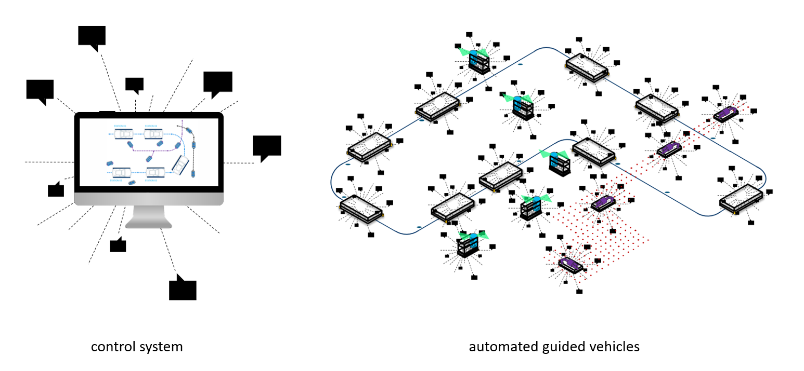

### 概要情報

無人搬送システム（DTS）の通信インターフェースの定義。
この推奨仕様は、社内物流プロセスにおける中央マスター制御と無人搬送車（AGV）間の注文データとステータスデータを交換するための通信インターフェースについて記述しています。

### 免責事項

以下の説明は、無人搬送車（AGV）とマスター制御間の通信インターフェースの実装のための指標として機能し、すべての人が自由に適用でき、拘束力はありません。
適用する者は、特定のケースにおいて適切に適用されることを確認する責任があります。

彼らは、各発行時点で一般的な技術水準を考慮する必要があります。
提案を適用することによって、誰も自分の行動に対する責任から逃れることはできません。
これらの声明は、既存の法律の完全または正確な解釈を主張するものではありません。
さらに、それぞれの製品の特性とその異なる可能な用途を考慮する必要があります。
この点に関しては、各自が自己責任で行動します。
VDAおよび提案の開発または適用に関与した者の責任は除外されます。

提案の適用において不正確さや誤った解釈の可能性に遭遇した場合は、欠陥を修正できるように、VDAに直ちに通知してください。

**発行者**
Verband der Automobilindustrie e.V. (VDA)
Behrenstraße 35, 10117 Berlin,
ドイツ
www.vda.de

**著作権**
自動車産業協会（VDA）
複製およびその他の形式の複製は、出典の明示がある場合にのみ許可されます。

バージョン 2.1.0

## 目次

[1 はじめに](#1-はじめに)  
[2 文書の目的](#2-文書の目的)  
[3 範囲](#3-範囲)  
[3.1 その他の適用文書](#31-その他の適用文書)  
[4 要件とプロトコル定義](#4-要件とプロトコル定義)  
[5 通信のプロセスと内容](#5-通信のプロセスと内容)  
[6 プロトコル仕様](#6-プロトコル仕様)  
[6.1 表の記号と書式の意味](#61-表の記号と書式の意味)  
[6.1.1 オプションフィールド](#611-オプションフィールド)  
[6.1.2 許可される文字とフィールド長](#612-許可される文字とフィールド長)  
[6.1.3 列挙の表記](#613-列挙の表記)  
[6.1.4 JSONデータ型](#614-jsonデータ型)  
[6.2 MQTT接続処理、セキュリティ、QoS](#62-mqtt接続処理セキュリティqos)  
[6.3 MQTTトピックレベル](#63-mqttトピックレベル)  
[6.4 プロトコルヘッダー](#64-プロトコルヘッダー)  
[6.5 通信用トピック](#65-通信用トピック)  
[6.6 トピック："order"（マスター制御からAGVへ）](#66-トピックorderマスター制御からagvへ)  
[6.6.1 コンセプトとロジック](#661-コンセプトとロジック)  
[6.6.2 注文と注文の更新](#662-注文と注文の更新)  
[6.6.3 注文のキャンセル（マスター制御による）](#663-注文のキャンセルマスター制御による)  
[6.6.4 注文の拒否](#664-注文の拒否)  
[6.6.5 走行経路](#665-走行経路)  
[6.6.6 注文メッセージの実装](#666-注文メッセージの実装)  
[6.7 マップ](#67-マップ)  
[6.7.1 マップ配布](#671-マップ配布)  
[6.7.2 車両状態のマップ](#672-車両状態のマップ)  
[6.7.3 マップダウンロード](#673-マップダウンロード)  
[6.7.4 ダウンロードしたマップの有効化](#674-ダウンロードしたマップの有効化)  
[6.7.5 車両上のマップの削除](#675-車両上のマップの削除)  
[6.8 アクション](#68-アクション)  
[6.8.1 事前定義されたアクションの定義、パラメータ、効果、範囲](#681-事前定義されたアクションの定義パラメータ効果範囲)  
[6.8.2 事前定義されたアクションの状態](#682-事前定義されたアクションの状態)  
[6.9 トピック："instantActions"（マスター制御からAGVへ）](#69-トピックinstantactionsマスター制御からagvへ)  
[6.10 トピック："state"（AGVからマスター制御へ）](#610-トピックstateagvからマスター制御へ)  
[6.10.1 コンセプトとロジック](#6101-コンセプトとロジック)  
[6.10.2 ノードの走行とエッジの進入/退出、アクションの起動](#6102-ノードの走行とエッジの進入退出アクションの起動)  
[6.10.3 ベースリクエスト](#6103-ベースリクエスト)  
[6.10.4 情報](#6104-情報)  
[6.10.5 エラー](#6105-エラー)  
[6.10.6 状態メッセージの実装](#6106-状態メッセージの実装)  
[6.11 actionStates](#611-actionstates)  
[6.12 アクションブロッキングタイプとシーケンス](#612-アクションブロッキングタイプとシーケンス)  
[6.13 トピック "visualization"](#613-トピックvisualization)  
[6.14 トピック "connection"](#614-トピックconnection)  
[6.15 トピック "factsheet"](#615-トピックfactsheet)  
[6.15.1 ファクトシートJSONの構造](#6151-ファクトシートjsonの構造)  
[7 ベストプラクティス](#7-ベストプラクティス)  
[7.1 エラー参照](#71-エラー参照)  
[7.2 パラメータのフォーマット](#72-パラメータのフォーマット)  
[8 用語集](#8-用語集)  
[8.1 定義](#81-定義)  

# 1 はじめに

このインターフェースは、自動車産業協会（VDA）とドイツ機械・プラント製造業協会（VDMA）の協力によって確立されました。
両団体の目的は、普遍的に適用可能なインターフェースを作成することです。
インターフェースへの変更提案はVDAに提出され、VDMAと共同で評価され、肯定的な決定が下された場合には新しいバージョンに採用されます。
GitHubを通じてこの文書への貢献は大いに歓迎されます。
リポジトリは次のリンクで見つけることができます: https://github.com/vda5050/vda5050

# 2 文書の目的

この推奨事項の目的は、新しい車両を既存のマスター制御システムに接続することを簡素化し、異なるメーカーからのAGVと従来のシステム（既存システム）が同じ作業環境で並行運転できるようにすることです。

マスター制御とAGV間の統一インターフェースを定義することを目指しています。
これは以下の点によって達成されるべきです：

- AGVとマスター制御間の通信標準の記述、および協調運用する搬送車両を使用した連続プロセス自動化への輸送システム統合の基礎の提供。
- 車両の自律性増加、プロセスモジュール、インターフェース、そして好ましくはイベント制御型コマンドチェーンの硬直したシーケンスからの分離などによる柔軟性の向上。
- 必要な情報（例：注文情報）が中央サービスによって提供され、一般的に有効であるため、「プラグ＆プレイ」機能の高さによる実装時間の短縮。車両は、労働安全要件を考慮し、メーカーに関係なく同じ実装努力で運用を開始できるはずです。
- すべての輸送車両、車両モデル、メーカーに対応する統一的で包括的な調整とそれに対応するロジックを使用することによる複雑性の削減と「プラグ＆プレイ」機能の向上。
- 車両制御と調整レベル間の共通インターフェースを使用したメーカーの独立性の向上。
- 独自のマスター制御と上位のマスター制御間の垂直通信を実装することによる独自のDTS既存システムの統合（図1参照）。

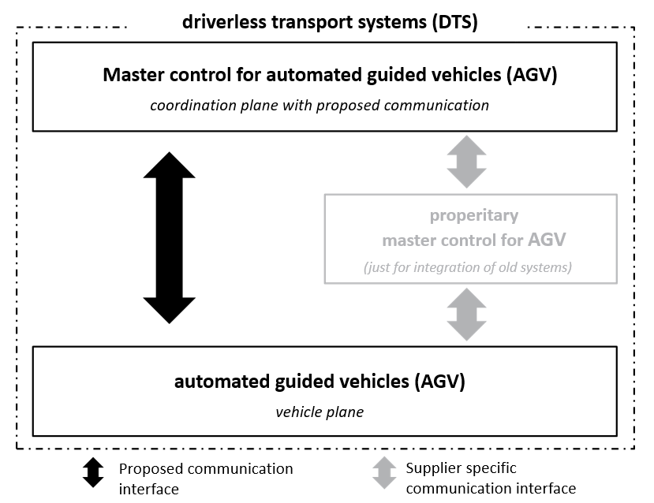
*図1 DTS既存システムの統合*

上記の目的を実現するために、この文書ではAGVとマスター制御間の注文とステータス情報の通信のためのインターフェースについて説明します。

AGVとマスター制御間で運用に必要なその他のインターフェース（例：パス計画に関して特別なスキルを自由に考慮するなど）や、他のシステムコンポーネント（例：外部周辺機器、防火ゲートなど）との通信については、この文書には最初は含まれていません。

# 3 範囲

この推奨事項には、無人搬送車（AGV）とマスター制御間の通信に関する定義とベストプラクティスが含まれています。
目標は、異なる特性を持つAGV（例：アンダーラントラクターやフォークリフトAGV）が統一された言語でマスター制御と通信できるようにすることです。
これにより、マスター制御内でAGVのあらゆる組み合わせを運用するための基礎が作られます。
マスター制御は注文を提供し、AGV交通を調整します。

このインターフェースは、自動車産業の生産工場物流からの要件に基づいています。
定式化された要件によれば、社内物流の要件には、自由に航行する車両と誘導車両の制御を通じて、商品受入から生産供給、商品出荷までの物流部門の要件が含まれています。

自動化された車両とは対照的に、自律型車両は対応するセンサーシステムとアルゴリズムに基づいて発生する問題を独自に解決し、動的環境の変化に適切に対応したり、すぐに後からそれに適応したりすることができます。
障害物の自律的な回避などの自律的な特性は、自由に航行する車両でも誘導車両でも満たすことができます。
ただし、パス計画が車両自体で実行される場合は、本書では自由に航行する車両について説明します（用語集参照）。
自律システムは完全に分散化されておらず（群知能）、事前に定義されたルールによって定義された動作をします。

持続可能なソリューションを目的として、以下ではその構造で拡張可能なインターフェースについて説明します。
これにより、誘導される車両のマスター制御の完全なカバレッジが可能になるはずです。
自由に航行する車両は構造に統合できますが、そのために必要な詳細な仕様はこの推奨事項の一部ではありません。

独自の在庫システムを統合するために、インターフェースの個別定義が必要な場合がありますが、これはこの推奨事項の一部として考慮されていません。

## 3.1 その他の適用文書

文書 | バージョン | 説明
---|---|---
VDI ガイドライン 2510 | 2005年10月 | 無人搬送システム（DTS）
VDI ガイドライン 4451 シート7 | 2005年10月 | 無人搬送システム（DTS）の互換性 - DTSマスター制御
DIN EN ISO 3691-4 | 2023年12月 | 産業用トラック安全要件と検証-パート4：無人トラックとそのシステム
LIF – Layout Interchange Format| 2024年3月 | 無人搬送車両のインテグレーターと（第三者）マスター制御システム間の交換のためのトラックレイアウトフォーマットの定義。

# 4 要件とプロトコル定義

通信インターフェースは、以下の要件をサポートするように設計されています：

- 最小1000台の車両の制御
- 異なる自律度を持つ車両の統合の実現
- 例えば、ルートの選択や交差点での動作に関する決定の実現

車両は定期的な間隔やステータスが変化したときにステータスを転送する必要があります。

通信は、接続障害やメッセージ損失の影響を考慮して、無線ネットワーク上で行われます。

メッセージプロトコルはMessage Queuing Telemetry Transport（MQTT）であり、JSON構造と併用する必要があります。
MQTT 3.1.1はこのプロトコルの開発中にテストされ、互換性のための最低限必要なバージョンです。
MQTTでは、「トピック」と呼ばれるサブチャネルにメッセージを配信することができます。
MQTTネットワークの参加者はこれらのトピックを購読し、自分に関係する、または興味のある情報を受け取ります。

JSON構造により、プロトコルを追加パラメータで将来的に拡張することが可能になります。
パラメータは英語で記述されており、プロトコルがドイツ語圏外でも読みやすく、理解しやすく、適用できるようになっています。

# 5 通信のプロセスと内容

AGVの運用には少なくとも以下の参加者が必要です：

- AGVシステムのオペレーターは基本情報を提供します
- マスター制御は運用を組織化し、管理します
- AGVは注文を実行します

図2は、運用フェーズでの通信内容を説明しています。
実装または修正の間、AGVとマスター制御は手動で設定されます。

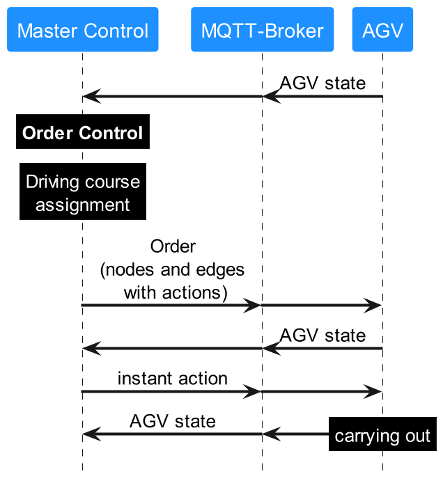
*図2 情報フローの構造*

実装フェーズでは、マスター制御とAGVで構成される無人搬送システム（DTS）がセットアップされます。
必要な枠組み条件はオペレーターによって定義され、必要な情報はオペレーターによって手動で入力されるか、他のシステムからインポートしてマスター制御に保存されます。
基本的には、以下の内容が含まれます：

- ルートの定義：CADインポートを使用して、ルートをマスター制御にインポートできます。
あるいは、ルートをオペレーターによってマスター制御に手動で実装することもできます。
ルートは一方通行、特定の車両グループ（サイズ比に基づく）に制限されるなどが可能です。
- ルートネットワーク設定：
ルート内に、積み降ろしのためのステーション、バッテリー充電ステーション、周辺環境（ゲート、エレベーター、バリア）、待機位置、バッファステーションなどが定義されます。
- 車両設定：AGVの物理的特性（サイズ、利用可能な荷台マウントなど）はオペレーターによって保存されます。
AGVはこの情報を本文書の[6.15 トピック "factsheet"](#615-トピックfactsheet)で定義された特定の方法で `factsheet` トピックを通じて通信する必要があります。

上記のルートとルートネットワークの設定は、この文書の一部ではありません。
これらは、この情報と完了すべき輸送要件に基づいて、マスター制御による注文制御と走行コース割り当てを可能にするための基礎を形成します。
AGVへの結果として生じる注文は、MQTTメッセージブローカーを介して車両に転送されます。
これは、注文の実行と並行して、継続的にそのステータスをマスター制御に報告します。
これもMQTTメッセージブローカーを使用して行われます。

マスター制御の機能：

- AGVへの注文の割り当て
- AGVのルート計算と誘導（各AGVの個別の物理的特性の制限を考慮、例：サイズ、操縦性など）
- ブロッケージ（「デッドロック」）の検出と解決
- エネルギー管理：充電注文は転送注文を中断できる
- 交通制御：バッファルートと待機位置
- 特定の領域の開放や最大速度の変更など、環境の（一時的な）変更
- ドア、ゲート、エレベーターなどの周辺システムとの通信
- 通信エラーの検出と解決

AGVの機能：

- 位置特定
- 関連ルートに沿った航行（誘導または自律）
- アクションの実行
- 車両ステータスの継続的な送信

さらに、インテグレーターは全体システムを構成する際に以下を考慮する必要があります（不完全なリスト）：

- マップ構成：マスター制御とAGVの座標系を一致させる必要があります。
- ピボットポイント：AGVの異なるポイントや充電ポイントをピボットポイントとして使用すると、車両の包絡線が異なります。参照ポイントは状況に応じて異なる場合があります。例えば、荷物を運ぶAGVと荷物を運ばないAGVでは異なる場合があります。

# 6 プロトコル仕様

次のセクションでは、通信プロトコルの詳細について説明します。
このプロトコルはマスター制御とAGV間の通信を規定しています。
AGVと周辺機器間の通信、例えばAGVとゲート間の通信は除外されています。

異なるメッセージは、注文、状態などとして送信されるJSONのフィールドの内容を記述する表で表されています。

さらに、検証のためのJSONスキーマが公開gitリポジトリ（https://github.com/VDA5050/VDA5050）で利用可能です。
JSONスキーマはVDA5050の各リリースで更新されます。JSONスキーマとこの文書の間に違いがある場合は、この文書のバージョンが適用されます。

## 6.1 表の記号と書式の意味

表には識別子の名前、その単位、そのデータ型、および説明（ある場合）が含まれています。

識別 | 説明
---|---
標準 | 変数は基本データ型
**太字** | 変数は非基本データ型（例：JSONオブジェクトまたは配列）で、別途定義されている
*イタリック* | 変数はオプション
***イタリックと太字***| 変数はオプションで非基本データ型
arrayName[arrayDataType] | 変数（ここではarrayName）は角括弧内に含まれるデータ型（ここではarrayDataType）の配列

すべてのキーワードは大文字と小文字を区別します。
すべてのフィールド名はキャメルケースです。
すべての列挙はアンダースコアなしの大文字です。

### 6.1.1 オプションフィールド

変数がオプションとマークされている場合、特定のケースでは変数が適用されない可能性があるため、送信者にとってオプションであることを意味します（例：マスター制御がAGVに注文を送信する場合、一部のAGVは自分でトラジェクトリを計画し、注文の `edge` オブジェクト内の `trajectory` フィールドを省略できます）。

AGVがこのプロトコルでオプションとしてマークされているフィールドを含むメッセージを受け取った場合、AGVはそれに応じて行動することが期待され、フィールドを無視することはできません。
AGVがメッセージを適切に処理できない場合、期待される動作はエラーメッセージ内でこれを通信し、注文を拒否することです。

マスター制御は、AGVがサポートするオプション情報のみを送信する必要があります。

例：トラジェクトリはオプションです。
AGVがトラジェクトリを処理できない場合、マスター制御は車両にトラジェクトリを送信してはいけません。

AGVは、AGV `factsheet` メッセージを通じて、必要なオプションパラメータを通信する必要があります。

### 6.1.2 許可される文字とフィールド長

すべての通信はUTF-8でエンコードされ、説明の国際的な適応を可能にします。
推奨事項として、IDは以下の文字のみを使用する必要があります：

A-Z a-z 0-9 _ - . :

最大メッセージ長は定義されていませんが、MQTTプロトコル仕様と、場合によっては、ファクトシート内で定義された技術的制約によって制限されます。
AGVのメモリが受信した注文を処理するのに不十分な場合は、注文を拒否する必要があります。
最大フィールド長、文字列長、または値範囲の一致はインテグレーターに委ねられています。
統合を容易にするために、AGVベンダーは[ファクトシートセクション](#616-トピックfactsheet)で詳述されるAGVファクトシートを提供する必要があります。

### 6.1.3 フィールド、トピック、列挙の表記

この文書のトピックとフィールドは、次のスタイルで強調表示されています：`exampleField` と `exampleTopic`。
列挙は大文字で書かれる必要があります。これらの値は文書内で単一引用符で囲まれています。
これには、`actionStatus` フィールド（'WAITING'、'FINISHED'など）のキーワードも含まれます。

### 6.1.4 JSONデータ型

可能な限り、JSONデータ型を使用する必要があります。
したがって、ブール値は列挙（'TRUE'、'FALSE'）やマジックナンバーではなく、「true」または「false」でエンコードされます。
数値データ型は型と精度で指定されます。例えば、float64またはuint32です。NaNや無限大などのIEEE 754の特殊な数値はサポートされていません。

## 6.2 MQTT接続処理、セキュリティ、QoS

MQTTプロトコルでは、クライアントの最終意思メッセージを設定するオプションが提供されています。
何らかの理由でクライアントが予期せず切断された場合、最終意思はブローカーによって他の購読クライアントに配信されます。
この機能の使用方法は[6.14 トピック "connection"](#614-トピックconnection)で説明されています。

AGVがブローカーから切断された場合、すべての注文情報を保持し、最後にリリースされたノードまで注文を実行します。

プロトコルセキュリティはブローカー構成によって考慮される必要があります。

通信オーバーヘッドを削減するために、トピック `order`、`instantActions`、`state`、`factsheet`、`visualization` にはMQTT QoSレベル0（ベストエフォート）を使用する必要があります。
トピック `connection` はQoSレベル1（少なくとも1回）を使用する必要があります。

## 6.3 MQTTトピックレベル

MQTTトピック構造は、クラウドプロバイダーの必須トピック構造のために厳密に定義されていません。
クラウドベースのMQTTブローカーの場合、トピック構造は個別に適応させ、このプロトコルで定義されたトピックと一致させる必要があります。
これは、次のセクションで定義されたトピック名が必須であることを意味します。

ローカルブローカーの場合、MQTTトピックレベルは次のように提案されています：

**interfaceName/majorVersion/manufacturer/serialNumber/topic**

例：
```
uagv/v2/KIT/0001/order
```

MQTTトピックレベル | データ型 | 説明
---|---|---
interfaceName | string | 使用されるインターフェースの名前
majorVersion | string | VDA 5050推奨事項のメジャーバージョン番号、「v」が前置される
manufacturer | string | AGVの製造元
serialNumber | string | 以下の文字で構成される一意のAGVシリアル番号: <br>A-Z <br>a-z <br>0-9 <br>_ <br>. <br>: <br>-
topic | string | トピック（例：orderまたはstate）[6.5 通信用トピック](#65-通信用トピック)を参照

注：「/」文字はトピック階層の定義に使用されるため、前述のフィールドでは使用しないでください。
「$」文字も一部のMQTTブローカーで特別な内部トピックに使用されるため、これも使用しないでください。

## 6.4 プロトコルヘッダー

各JSONメッセージはヘッダーで始まります。
以下のセクションでは、読みやすさのためにヘッダーとして以下のフィールドが参照されます。
ヘッダーは以下の個々の要素で構成されています。
ヘッダーはJSONオブジェクトではありません。

オブジェクト構造/識別子 | データ型 | 説明
---|---|---
headerId | uint32 | メッセージのヘッダーID。<br> headerIdはトピックごとに定義され、送信される（必ずしも受信されるとは限らない）メッセージごとに1ずつ増加します。
timestamp | string | タイムスタンプ（ISO 8601、UTC）；YYYY-MM-DDTHH:mm:ss.ffZ（例："2017-04-15T11:40:03.12Z"）。
version | string | プロトコルのバージョン [Major].[Minor].[Patch]（例：1.3.2）。
manufacturer | string | AGVの製造元。
serialNumber | string | AGVのシリアル番号。

### プロトコルバージョン

プロトコルバージョンはバージョニングスキーマとしてセマンティックバージョニングを使用しています。

メジャーバージョン変更の例：

- 新しい非オプションフィールドなどの破壊的変更

マイナーバージョン変更の例：

- 視覚化のための追加トピックなどの新機能

パッチバージョンの例：

- batteryChargeのためのより高い利用可能な精度

## 6.5 通信用トピック

AGVプロトコルは、マスター制御とAGV間の情報交換に以下のトピックを使用します。

トピック名 | 発行者 | 購読者 | 用途 | 実装 | スキーマ
---|---|---|---|---|---
order | マスター制御 | AGV | マスター制御からAGVへの走行命令の通信 | 必須 | order.schema
instantActions | マスター制御 | AGV | 即時に実行されるべきアクションの通信 | 必須 | instantActions.schema
state | AGV | マスター制御 | AGV状態の通信 | 必須 | state.schema
visualization | AGV | 視覚化システム | 視覚化目的のみのための位置トピックの高頻度 | オプション | visualization.schema
connection | ブローカー/AGV | マスター制御 | AGV接続が失われたときを示す、車両の健全性チェックにはマスター制御によって使用されない、MQTT プロトコルレベルの接続チェックのために追加 | 必須 | connection.schema 
factsheet | AGV | マスター制御 | マスター制御でのAGVの設定を支援するパラメータやベンダー固有の情報 | 必須 | factsheet.schema

## 6.6 トピック："order"（マスター制御からAGVへ）

トピック "order" は、AGVがJSON encapsulatedの注文を受信するMQTTトピックです。

### 6.6.1 コンセプトとロジック

注文の基本構造はノードとエッジのグラフです。
AGVはノードとエッジを走行して注文を実行することが期待されています。
すべての接続されたノードとエッジの完全なグラフはマスター制御によって保持されています。

マスター制御のグラフ表現には、どのAGVがどのエッジを走行できるかなどの制限が含まれています。
これらの制限はAGVに通信されません。
マスター制御は、対象のAGVが走行を許可されているエッジのみをAGV注文に含めます。

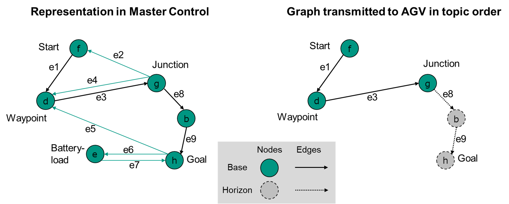
*図3 マスター制御のグラフ表現と注文で送信されるグラフ*

ノードとエッジは注文メッセージ内の2つのリストとして渡されます。
これらのリスト内のノードとエッジの順序も、ノードとエッジがどのシーケンスで走行されるべきかを規定します。

有効な注文のためには、少なくとも1つのノードが必要であり、エッジの数はノードの数より1つ少なくなければなりません。

注文の最初のノードはAGVにとって自明に到達可能でなければなりません。
これはAGVが既にノード上に立っているか、ノードの偏差範囲内にあることを意味します。

ノードとエッジの両方に、ブール属性 `released` があります。
ノードまたはエッジがリリースされている場合、AGVはそれを走行することが期待されています。
ノードまたはエッジがリリースされていない場合、AGVはそれを走行してはいけません。

エッジは、そのエッジの開始ノードと終了ノードの両方がリリースされている場合にのみリリースできます。

リリースされていないエッジの後には、シーケンス内にリリースされたノードやエッジが続くことはできません。

リリースされたノードとエッジのセットは「ベース」と呼ばれます。
リリースされていないノードとエッジのセットは「ホライズン」と呼ばれます。

ホライズンなしで注文を送信することは有効です。

注文メッセージは必ずしも完全な輸送注文を記述するものではありません。
交通制御とリソースに制約のある車両に対応するために、完全な輸送注文（多くのノードとエッジで構成される可能性がある）は、`orderId` と `orderUpdateId` を通じて接続される多くのサブオーダーに分割できます。
注文を更新するプロセスは次のセクションで説明されています。

### 6.6.2 注文と注文の更新

交通管理をサポートするために、マスター制御は注文を通じて通信されるパスを2つの部分に分割できます：

- *"ベース"*：これはAGVが走行を許可されている定義されたルートです。ベースルートのすべてのノードとエッジは、すでにマスター制御によって車両のためにリリースされています。ベースの最後のノードは決定点と呼ばれます。
- *"ホライズン"*：これはマスター制御によって現在、AGVが決定点の後に走行するために計画されているルートです。ホライズンルートはまだマスター制御によってリリースされていません。

AGVは、ベースにさらなるノードとエッジが追加されない場合は、決定点で停止する必要があります。流動的な動きを確保するために、交通状況が許す場合、マスター制御はAGVが決定点に到達する前にベースを拡張する必要があります。

MQTTは非同期プロトコルであり、無線ネットワークを介した送信は信頼性がないため、ベースを変更することはできません。したがって、マスター制御はベースが既にAGVによって実行されていると想定する必要があります。後のセクションでは、注文をキャンセルする手順について説明していますが、これも上記の通信の制限のため信頼性がないと考えられています。

マスター制御は、変更されたノードとエッジのリストを含む更新されたルートをAGVに送信することで、ホライズンを変更する可能性があります。ホライズンルートを変更する手順を図4に示します。

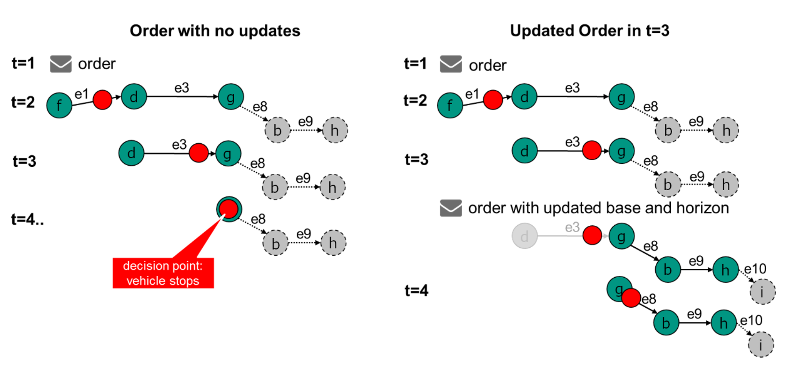
*図4 走行ルート"ホライズン"を変更する手順*

図4では、最初にt = 1の時点で制御パネルから最初のジョブが送信されます。
図5に可能なジョブの疑似コードを示します。
読みやすさのために、完全なJSON例はここでは省略されています。

```
{
    orderId: "1234"
    orderUpdateId:0,
    nodes: [
         f {released: True},
         d {released: True},
         g {released: True},
         b {released: False},
         h {released: False}
    ],
    edges: [
        e1 {released: True},
        e3 {released: True},
        e8 {released: False},
        e9 {released: False}
    ]
}
```
*図5 注文の疑似コード*

t = 3の時点で、注文の拡張を送信することで注文が更新されます（図6の例を参照）。
`orderUpdateId` が増加し、注文更新の最初のノードが前の注文メッセージの最後の共有ベースノードに対応していることに注意してください。

これにより、AGVも注文更新を実行できることが保証されます。つまり、注文更新の最初のノードはAGVが既に知っているエッジを実行することで到達可能です。

```
{
    orderId: 1234,
    orderUpdateId: 1,
    nodes: [
        g {released: True},
        b {released: True},
        h {released: True},
        i {released: False}
    ],
    edges: [
        e8 {released: True},
        e9 {released: True},
        e10 {released: False}
    ]
}
```
*図6 注文更新の疑似コード。`orderUpdateId` の変更に注意*

これは、注文更新が失われた場合（例：信頼性の低い無線ネットワークのため）にも役立ちます。
AGVは常に、最後に知られているベースノードが新しいベースノードの最初のノードと同じ `nodeId`（および `nodeSequenceId`、詳細は後述）を持っているかどうかを確認できます。

また、ノードgはベースノードのうち再送信される唯一のノードであることに注意してください。
ベースは変更できないため、ノードfとdの再送信は有効ではありません。

つなぎ合わせノード（例の場合はノードg）の内容を変更しないことが重要です。
アクション、偏差範囲などについては、AGVは最初の注文（図5、orderUpdateId 0）で提供された指示を使用する必要があります。

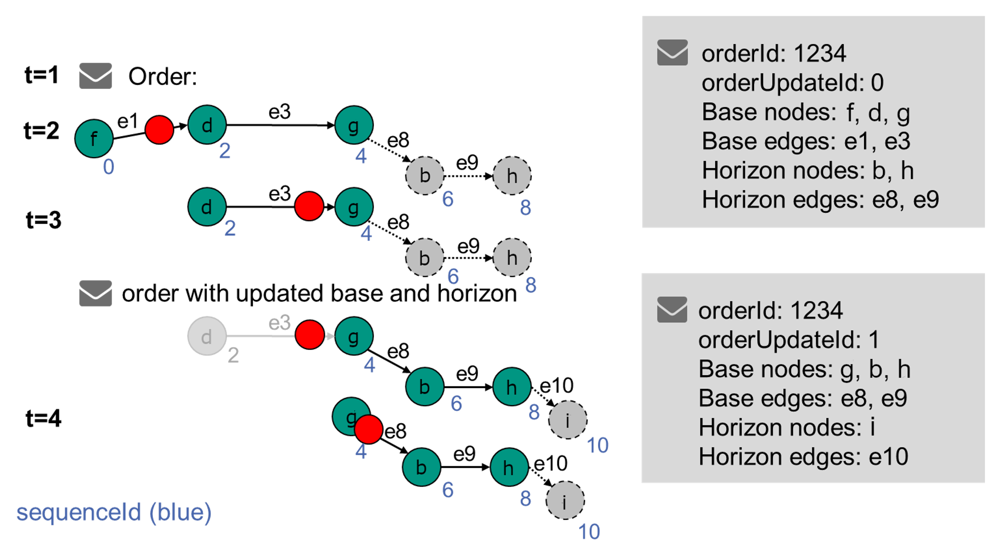
*図7 通常の更新プロセス - 注文拡張*

図7は、注文をどのように拡張すべきかを説明しています。
これは現在AGVで利用可能な情報を示しています。
`orderId` は同じままで、`orderUpdateId` は増加しています。

前のベースの最後のノードは、更新された注文の最初のベースノードです。
このノードを使用して、AGVは更新された注文を現在の注文に追加できます（つなぎ合わせ）。
前のベースの他のノードとエッジは再送信されません。

マスター制御には、新しいベースとして完全に異なるノードを送信することでホライズンに変更を加えるオプションがあります。
ホライズンを削除することもできます。

注文内でループを許可するために（例：ノードaからbに行き、その後aに戻る）、`sequenceId` がノードとエッジオブジェクトに割り当てられます。
この `sequenceId` はノードとエッジ上で実行されます（注文の最初のノードは0を受け取り、最初のエッジは1を取得し、2番目のノードは2を取得し、以降同様）。
これにより、注文の進行状況の追跡が容易になります。

一度 `sequenceId` が割り当てられると、注文更新でも変更されません（図7を参照）。
これは、マスター制御が参照しているノードをAGV側で判断するために必要です。

図8は、注文または注文更新を受け入れるプロセスを説明しています。

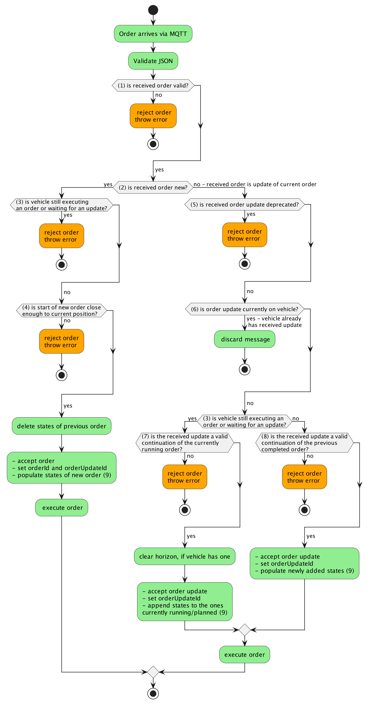
*図8 注文または注文更新を受け入れるプロセス*

1) **受信した注文は有効か?**:
すべての書式とJSONデータ型は正しいか?

2) **受信した注文は新規か、現在の注文の更新か?**:
受信した注文の `orderId` は車両が現在保持している注文の `orderId` と異なるか?

3) **車両はまだ注文を実行中か、更新を待っているか?**:
`nodeStates` が空でないか、または `actionStates` に'FAILED'でも'FINISHED'でもない状態を含んでいるか? 注文ホライズンのノードとエッジおよび対応するアクション状態も状態内に含まれています。車両はまだホライズンを持っている可能性があり、したがって更新を待っていて注文を実行中です。

4) **新しい注文の開始は現在の位置に十分近いか?**:	車両が既にノード上に立っているか、またはノードの偏差範囲内にあるか（[6.6.1 コンセプトとロジック](#661-コンセプトとロジック)を参照）?

5) **受信した注文更新は非推奨か?**: `orderUpdateId` は車両で現在使用されているものより小さいか?

6) **受信した注文更新は現在車両にあるか?**: `orderUpdateId` は車両で現在使用されているものと等しいか?

7) **受信した更新は現在もまだ実行中の注文の有効な継続か?**:	受信した注文の最初のノードは現在の決定点（現在のベースの最後のノード）と等しいか? 車両はまだ移動中か、前の注文更新でリリースされたベースに関連するアクションを実行中か、またはまだホライズンを持っており、したがって注文の継続を待っています。この場合、注文更新は新しいベースの最初のノードが前のベースの最後のノードと等しい場合にのみ受け入れられます。

8) **受信した更新は以前に完了した注文の有効な継続か?**: 受信した注文更新の最初のノードの `nodeId` と `sequenceId` は `lastNodeId` と `lastNodeSequenceId` と等しいか? 車両はもはやアクションを実行していないし、注文の継続を待っているわけでもありません（つまり、関連するすべてのアクションを含むベースを完了し、ホライズンを持っていない）。注文更新は最後に走行したノードから続く場合に受け入れられます、したがって新しいベースの最初のノードは車両の `lastNodeId` および `lastNodeSequenceId` と一致する必要があります。

9) 状態を入力/追加は、`actionStates`/`nodeStates`/`edgeStates` を指します。

### 6.6.3 注文のキャンセル（マスター制御による）

ベースノードに予期しない変更がある場合、instantAction `cancelOrder` を使用して注文をキャンセルする必要があります。

instantAction `cancelOrder` を受け取った後、車両は停止します（その能力に基づいて、例えば右にあるところか、次のノードで）。

スケジュールされたアクションがある場合、これらのアクションはキャンセルされ、`actionState` で 'FAILED' と報告される必要があります。
実行中のアクションがある場合、それらのアクションもキャンセルされ、'FAILED' として報告される必要があります。
アクションが中断できない場合、そのアクションの `actionState` はその実行中は 'RUNNING' と報告し、その後それぞれの状態（成功した場合は 'FINISHED'、そうでない場合は 'FAILED'）を報告する必要があります。
アクションが実行中の間、cancelOrderアクションは、すべてのアクションがキャンセル/完了するまで 'RUNNING' と報告する必要があります。
車両のすべての動きとそのすべてのアクションが停止した後、`cancelOrder` アクション状態は 'FINISHED' と報告する必要があります。

`orderId` と `orderUpdateId` は保持されます。

図9は、異なるAGV能力に対する期待される動作を示しています。

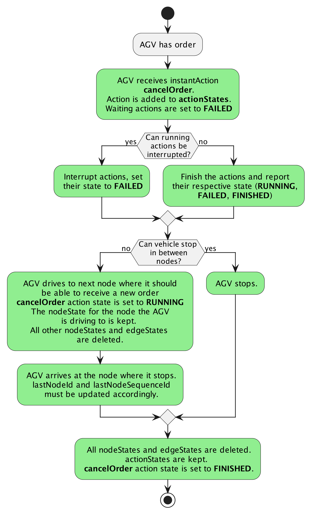
*図9 `cancelOrder` 後の期待される動作*

#### 6.6.3.1 キャンセル後の新しい注文の受信

注文のキャンセル後、車両は新しい注文を受け取る状態になる必要があります。

タグを介してノード上で自己位置を特定するAGVの場合、新しい注文はAGVが現在立っているノードから始める必要があります（図5も参照）。

ノード間で停止できるAGVの場合、次の注文をどのように開始すべきかはマスター制御に委ねられています。
AGVは両方の方法を受け入れる必要があります。

2つのオプションがあります：

- AGVが現在立っている位置に配置された一時的なノードが最初のノードである注文を送信します。AGVはこのノードが自明に到達可能であることを認識し、注文を受け入れる必要があります。
- 前の注文の最後に走行したノードが最初のノードである注文を送信しますが、偏差範囲を非常に大きく設定して、AGVがこの範囲内にあるようにします。したがって、AGVはこのノードが走行済みとみなされるべきであることを認識し、注文を受け入れる必要があります。

#### 6.6.3.2 AGVに注文がない場合の cancelOrder アクションの受信

AGVが `cancelOrder` アクションを受け取っても、AGVが現在注文を持っていない、または前の注文がキャンセルされた場合、`cancelOrder` アクションは 'FAILED' として報告されるべきです。

AGVは "noOrderToCancel" エラーを `errorLevel` を 'WARNING' に設定して報告する必要があります。
`instantAction` の `actionId` は `errorReference` として渡される必要があります。

### 6.6.4 注文の拒否

注文が拒否されるべきいくつかのシナリオがあります。
これらのシナリオは図8に示され、以下に説明されています。

#### 6.6.4.1 車両が不正な形式の新しい注文を受け取る

解決策：

1. 車両は新しい注文を内部バッファに取り込みません。
2. 車両は警告 "validationError" を報告します
3. 警告は、車両が新しい注文を受け入れるまで報告される必要があります。

#### 6.6.4.2 車両が実行できないアクションや使用できないフィールドを含む注文を受け取る

例：

- 実行不可能なアクション：最大リフト高さよりも高いリフト高さ、ストロークが取り付けられていないのにリフトアクションなど。
- 使用不可能なフィールド：トラジェクトリなど。

解決策：

1. 車両は新しい注文を内部バッファに取り込みません
2. 車両はエラー参照として間違ったフィールドを含む警告 "orderError" を報告します
3. 警告は、車両が新しい注文を受け入れるまで報告される必要があります。

#### 6.6.4.3 車両が同じorderId だが現在のorderUpdateIdより低いorderUpdateIdを持つ新しい注文を受け取る

解決策：

1. 車両は新しい注文を内部バッファに取り込みません。
2. 車両は前の注文をバッファに保持します。
3. 車両は警告 "orderUpdateError" を報告します
4. 車両は前の注文の実行を継続します。

AGVが同じ `orderId` と `orderUpdateId` を持つ注文を2回受け取った場合、2番目の注文は無視されます。
これは、マスター制御が状態メッセージを受け取るのが遅すぎて最初の注文が受信されたことを確認できなかったため、注文を再送信した場合に発生する可能性があります。

### 6.6.5 走行経路

オプションの `corridor` エッジ属性により、車両は障害物回避のためにエッジトラジェクトリから逸脱することが可能になり、車両が操作を許可される境界を定義します。
`corridor` 属性を使用するには、`corridor` 属性が定義されていない場合に車両が従うであろう事前定義されたトラジェクトリが必要です。これは、マスター制御に知られている車両上で定義されたトラジェクトリ、または注文で送信されたトラジェクトリのいずれかです。`corridor` 属性を使用する車両の動作は、障害物を回避するためにトラジェクトリから一時的に逸脱することが許可されていることを除いて、ライン誘導車両の動作と同じです。

*備考：
注文内のエッジは、開始ノードから終了ノードへ車両が走行する際の（実際の）トラジェクトリを必ずしも定義するものではなく、2つのノード間の論理的な接続を定義します。
車両のタイプに応じて、開始ノードと終了ノード間で車両が取るトラジェクトリは、トラジェクトリエッジ属性を介してマスター制御によって定義されるか、事前定義されたトラジェクトリとして車両に割り当てられます。
車両の内部状態に応じて、選択されるトラジェクトリは変化する可能性があります。*

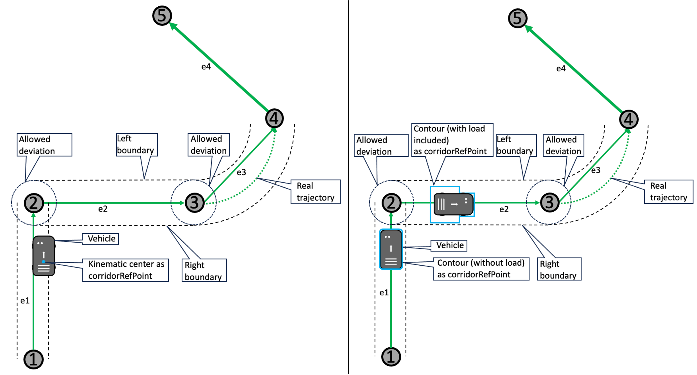
*図10 障害物を回避するために事前定義されたトラジェクトリから逸脱することを許可する左右の境界を定義する `corridor` 属性を持つエッジ。左側では、キネマティックセンターが許可される偏差を定義し、右側では、車両の輪郭（荷物によって拡張される可能性あり）が許可される偏差を定義しています。これは `corridorRefPoint` パラメータによって定義されます。*

車両が独立して航行することを許可されるエリア（元のエッジトラジェクトリから逸脱）は、左右の境界によって定義されます。
オプションの `corridorRefPoint` フィールドは、車両制御点または車両輪郭が定義された境界内にあるべきかどうかを指定します。
エッジの境界は、車両がノードを通過するとすぐに新しい現在のエッジの境界内に車両が入るように定義される必要があります。
corridor境界をゼロに設定する代わりに、車両がトラジェクトリから逸脱してはならない場合、マスター制御は `corridor` 属性を使用すべきではありません。

車両の動き制御ソフトウェアは、車両が定義された境界内にあることを常にチェックする必要があります。
そうでない場合、車両は許可された航行スペースの外にあるため停止し、エラーを報告する必要があります。
マスター制御はユーザー介入が必要かどうかを決定でき、または現在の注文をキャンセルし、車両が再び移動できる corridor情報を持つ新しい注文を車両に送信することで車両が継続できるようにすることができます。

*備考：トラジェクトリからの逸脱を車両に許可することで、走行中の車両の可能なフットプリントが増加します。この状況は初期運用時に考慮する必要があり、マスター制御が車両のフットプリントに基づいて交通制御の決定を行う場合も同様です。*

詳細については、[6.10.2 ノードの走行とエッジの進入/退出](#6102-ノードの走行とエッジの進入退出アクションの起動)を参照してください。

## 6.6.6 注文メッセージの実装

オブジェクト構造 | 単位 | データ型 | 説明
---|---|---|---
headerId | | uint32 | メッセージのヘッダーID。<br> ヘッダーIDはトピックごとに定義され、送信される（必ずしも受信されるとは限らない）メッセージごとに1ずつ増加します。
timestamp | | string | タイムスタンプ（ISO 8601、UTC）；YYYY-MM-DDTHH:mm:ss.ffZ（例："2017-04-15T11:40:03.12Z"）
version | | string | プロトコルのバージョン [Major].[Minor].[Patch]（例：1.3.2）
manufacturer | | string | AGVの製造元
serialNumber | | string | AGVのシリアル番号
orderId | | string | 注文識別。<br>これは同じ注文に属する複数の注文メッセージを識別するために使用されます。
orderUpdateId | | uint32 | 注文更新識別。<br>orderIdごとに一意です。<br>注文更新が拒否された場合、このフィールドは拒否メッセージで渡されるべきです。
*zoneSetId* | | string | AGVが航行に使用する必要があるか、またはマスター制御が計画に使用したゾーンセットの一意の識別子。<br><br>オプション：一部のマスター制御システムはゾーンを使用しません。<br>一部のAGVはゾーンを理解しません。<br>ゾーンが使用されていない場合、メッセージに追加しないでください。
**nodes [node]** | | array | 注文を実行するために走行するノードオブジェクトの配列。<br>有効な注文には1つのノードで十分です。<br>その場合、エッジ配列を空にしてください。
**edges [edge]** | | array | 注文を実行するために走行するエッジオブジェクトの配列。<br>有効な注文には1つのノードで十分です。<br>その場合、エッジ配列を空にしてください。

オブジェクト構造 | 単位 | データ型 | 説明
---|---|---|---
**node** { | | JSONオブジェクト|
nodeId | | string | 一意のノード識別
sequenceId | | uint32 | 注文内のノードとエッジのシーケンスを追跡し、注文更新を簡素化するための番号。<br>主な目的は、1つの orderId 内で複数回通過されるノードを区別することです。<br>シーケンス変数 sequenceId は同じ注文のすべてのノードとエッジにわたって実行され、新しい orderId が発行されるとリセットされます。
*nodeDescription* | | string | ノードに関する追加情報
released | | boolean | "true" はノードがベースの一部であることを示します。<br>"false" はノードがホライズンの一部であることを示します。
***nodePosition*** | | JSONオブジェクト | ノード位置。<br>ノードの位置を必要としない車両タイプ（例：ライン誘導車両）にはオプションです。
**actions [action]** <br> } | | array | ノードで実行するアクションの配列。<br>アクションが不要な場合は空の配列。

オブジェクト構造 | 単位 | データ型 | 説明
---| --- |--- | ---
**nodePosition** { | | JSONオブジェクト | プロジェクト固有の世界座標系でのマップ上の位置を定義します。<br>各フロアには独自のマップがあります。<br>すべてのマップは同じプロジェクト固有のグローバル原点を使用する必要があります。
x | m | float64 | マップ座標系を基準としたマップ上のX位置。<br>精度は特定の実装によります。
y | m | float64 | マップ座標系を基準としたマップ上のY位置。<br>精度は特定の実装によります。
*theta* | rad | float64 | 範囲：[-Pi ... Pi] <br><br>ノード上のAGVの絶対的な方向。<br>オプション：車両は自分でパスを計画できます。<br>定義されている場合、AGVはこのノード上でtheta角度を想定する必要があります。<br>前のエッジが回転を許可しない場合、AGVはノード上で回転する必要があります。<br>続くエッジが異なる方向を定義しているが回転を許可しない場合、AGVはエッジに入る前にエッジが望む回転にノード上で回転する必要があります。
*allowedDeviationXY* | m | float64 | AGVがノードを走行済みとみなすために、ノードの位置にどれだけ正確に一致する必要があるかを示します。<br><br>= 0.0の場合：偏差は許可されません（偏差なしとはAGV製造元の通常の許容範囲内であることを意味します）。<br><br>> 0.0の場合：メートル単位の許容偏差半径。<br>AGVが偏差半径内でノードを通過する場合、ノードは走行済みとみなすことができます。
*allowedDeviationTheta* | rad | float64 | 範囲：[0.0 ... Pi] <br><br>ノード上でAGVがthetaで定義された方向にどれだけ正確に一致する必要があるかを示します。<br>最低許容角度はtheta - allowedDeviationThetaで、最高許容角度はtheta + allowedDeviationThetaです。
mapId | | string | 位置が参照されるマップの一意の識別。<br>各マップは同じプロジェクト固有のグローバル座標原点を持っています。<br>AGVがエレベーターを使用する場合、例えば出発階から目標階へ導くエレベーターでは、出発階のマップから消え、目標階のマップの関連するリフトノードに出現します。
*mapDescription* <br> } | | string | マップに関する追加情報。

オブジェクト構造 | 単位 | データ型 | 説明
---|---|---|---
**action** { | | JSONオブジェクト | AGVが実行できるアクションを記述します。
actionType | | string | "Actions and Parameters"の最初の列に記述されているアクションの名前。<br>アクションの機能を識別します。
actionId | | string | アクションを識別し、それらを状態内のactionStateにマッピングするための一意のID。<br>提案：UUIDを使用してください。
*actionDescription* | | string | アクションに関する追加情報
blockingType | | string | Enum {'NONE', 'SOFT', 'HARD'}: <br>'NONE': 運転と他のアクションを許可します；<br>'SOFT': 他のアクションを許可しますが運転を許可しません；<br>'HARD': その時点で唯一許可されるアクションです。
***actionParameters [actionParameter]*** <br><br> } | | array | 指定されたアクションのactionParameterオブジェクトの配列、例えば "deviceId"、"loadId"、"external triggers"。<br><br>実装例は[7.2 パラメータのフォーマット](#72-パラメータのフォーマット)で見つけることができます。

オブジェクト構造 | 単位 | データ型 | 説明
---|---|---|---
**edge** { | | JSONオブジェクト | 2つのノード間の方向性のある接続。
edgeId | | string | 一意のエッジ識別。
sequenceId | | uint32 | 注文内のノードとエッジのシーケンスを追跡し、注文更新を簡素化するための番号。<br>シーケンス変数sequenceIdは同じ注文のすべてのノードとエッジにわたって実行され、新しいorderIdが発行されるとリセットされます。
*edgeDescription* | | string | エッジに関する追加情報。
released | | boolean | "true"はエッジがベースの一部であることを示します。<br>"false"はエッジがホライズンの一部であることを示します。
startNodeId | | string | 注文内の最初のノードのnodeId。
endNodeId | | string | 注文内の最後のノードのnodeId。
*maxSpeed* | m/s | float64 | エッジ上での許容最大速度。<br>速度は車両の最速測定値によって定義されます。
*maxHeight* | m | float64 | エッジ上での荷物を含む車両の許容最大高さ。
*minHeight* | m | float64 | エッジ上での荷役装置の許容最小高さ。
*orientation* | rad | float64 | エッジ上のAGVの方向。`orientationType`の値は、それがグローバルプロジェクト固有のマップ座標系に対して相対的に解釈されるか、エッジに対して接線方向に解釈されるかを定義します。エッジに対して接線方向に解釈される場合、0.0は前進を示し、PIは後進を示します。<br>例：方向Pi/2 radは90度の回転をもたらします。<br><br>AGVが異なる方向で開始する場合、`rotationAllowed`が "true" に設定されていれば、エッジ上で車両を望ましい方向に回転させます。<br>`rotationAllowed`が "false" の場合、エッジに入る前に回転させます。<br>それが不可能な場合、注文を拒否します。<br><br>トラジェクトリが定義されていない場合、エッジの2つの接続ノード間の直接パスに回転を適用します。<br>エッジにトラジェクトリが定義されている場合、トラジェクトリに方向を適用します。
*orientationType* | | string | Enum {'GLOBAL', 'TANGENTIAL'}: <br>'GLOBAL': グローバルプロジェクト固有のマップ座標系に対して相対的；<br>'TANGENTIAL': エッジに対して接線方向。<br><br>定義されていない場合、デフォルト値は 'TANGENTIAL' です。
*direction* | | string | ライン誘導または有線誘導車両のための交差点での方向を設定し、初期に定義されるべき（車両個別）。<br>例："left"、"right"、"straight"。
*rotationAllowed* | | boolean | "true": エッジ上での回転が許可されます。<br>"false": エッジ上での回転は許可されません。<br><br>オプション：<br>設定されていない場合、制限はありません。
*maxRotationSpeed* | rad/s | float64| 最大回転速度<br><br>オプション：<br>設定されていない場合、制限はありません。
***trajectory*** | | JSONオブジェクト | このエッジのトラジェクトリJSONオブジェクト（NURBS形式）。<br>エッジの開始ノードと終了ノード間でAGVが移動すべきパスを定義します。<br><br>オプション：<br>AGVがトラジェクトリを処理できない場合や、AGVが独自のトラジェクトリを計画する場合は省略できます。
*length* | m | float64 | 開始ノードから終了ノードまでのパスの長さ<br><br>オプション：<br>この値はライン誘導AGVが停止位置に達する前に速度を下げるために使用されます。
***corridor*** | | JSONオブジェクト | 車両がトラジェクトリから逸脱できる境界の定義、例えば障害物を避けるため。<br>
**action [action]**<br><br><br> } | | array | エッジ上で実行するアクションの配列。<br>アクションが不要な場合は空の配列。<br>エッジによってトリガーされるアクションは、AGVがアクションをトリガーしたエッジを走行している時間のみアクティブになります。<br>AGVがエッジを離れると、アクションは停止し、エッジに入る前の状態が復元されます。


オブジェクト構造 | 単位 | データ型 | 説明
---|---|---|---
**trajectory** { | | JSONオブジェクト |
degree | | float64 | 範囲：[1.0 ... float64.max]<br><br>トラジェクトリを定義するNURBS曲線の次数。<br><br>定義されていない場合、デフォルト値は1です。
**knotVector [float64]** | | array | 範囲：[0.0 ... 1.0]<br><br>NURBSのノット値の配列。<br><br>knotVectorのサイズは制御点の数 + 次数 + 1です。
**controlPoints [controlPoint]**<br><br> } | | array | NURBSの制御点を定義するcontrolPointオブジェクトの配列、開始点と終了点を明示的に含みます。

オブジェクト構造 | 単位 | データ型 | 説明
---|---|---|---
**controlPoint** { | | JSONオブジェクト |
x | | float64 | 世界座標系で記述されたX座標。
y | | float64 | 世界座標系で記述されたY座標。
*weight* | | float64 | 範囲：[0.0 ... float64.max]<br><br>曲線上の制御点の重み。<br>定義されていない場合、デフォルトは1.0です。
} | | |

オブジェクト構造 | 単位 | データ型 | 説明
---|---|---|---
***corridor*** { | | JSONオブジェクト |
leftWidth | m | float64 | 範囲：[0.0 ... float64.max]<br>車両のトラジェクトリに関連して左側の走行経路の幅をメートル単位で定義します（図13参照）。
rightWidth | m | float64 | 範囲：[0.0 ... float64.max]<br>車両のトラジェクトリに関連して右側の走行経路の幅をメートル単位で定義します（図13参照）。
*corridorRefPoint* <br><br>**}**| | string | 境界が車両の運動学的中心または車両の輪郭に対して有効かどうかを定義します。指定されていない場合、境界は車両の運動学的中心に対して有効です。<br> Enum { 'KINEMATICCENTER' , 'CONTOUR' }

### 6.7 マップ

異なるタイプのAGV間で一貫したナビゲーションを確保するために、位置は常にプロジェクト固有の座標系を参照して指定されます（図11参照）。
サイトまたは場所の異なるレベルを区別するために、一意の `mapId` が使用されます。
マップ座標系は、z軸が空に向かって指す右手座標系として指定する必要があります。
したがって、正の回転は反時計回りの回転として理解されるべきです。
車両座標系も、x軸が車両の前方向を指し、z軸が上向きを指す右手座標系として指定されます。車両の基準点は、特に指定がない限り、車両の基準フレームで（0,0,0）として定義されます。
これはDIN ISO 8855のセクション2.11に準拠しています。

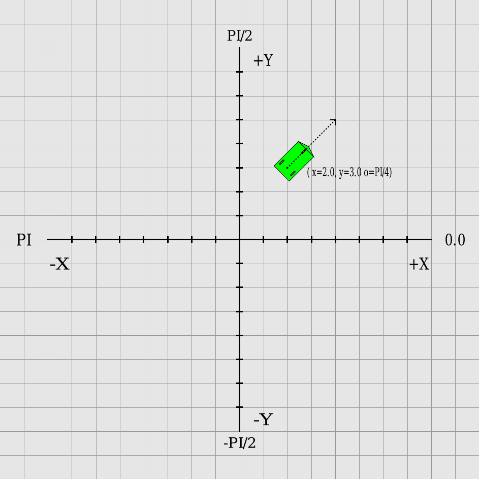
*図11 座標系とサンプルAGVと方向*

X、Y、およびZ座標はメートル単位で指定する必要があります。
方向はラジアン単位であり、+Piと–Piの範囲内である必要があります。

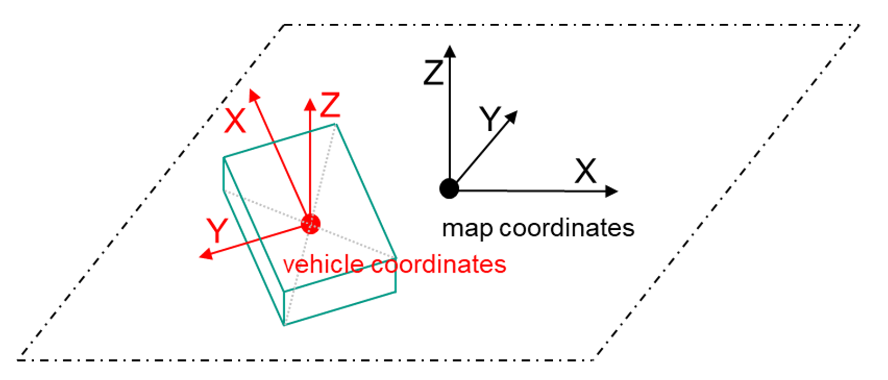
*図12 マップと車両の座標系*


### 6.7.1 マップ配布

自動マップ配布と必要に応じて車両を再起動するインテリジェントな管理を可能にするために、マップを配布する標準的な方法が導入されています。

配布されるマップファイルは、車両がアクセスできる専用のマップサーバーに保存されます。効率的な送信を確保するために、各送信は単一のファイルから構成されるべきです。複数のマップまたはファイルが必要な場合は、それらを単一のファイルにバンドルまたはパッキングする必要があります。マップサーバーから車両へのマップの転送は、マスター制御が `instantAction` を使用してダウンロードコマンドをトリガーするプル操作です。

各マップは、マップ識別子（フィールド `mapId`）とマップバージョン（フィールド `mapVersion`）の組み合わせによって一意に識別されます。マップ識別子は車両の物理的作業空間の特定の領域を説明し、マップバージョンは以前のバージョンへの更新を示します。新しい注文を受け入れる前に、車両は要求された注文内の各マップ識別子に対して車両上にマップがあることを確認する必要があります。車両を操作するために正しいマップが有効化されていることを確認するのはマスター制御の責任です。

ダウンタイムを最小限に抑え、マスター制御が新しいマップの有効化を同期しやすくするために、マップが車両上に事前にロードまたはバッファリングされることが不可欠です。車両上のマップのステータスは車両状態チャネルを通じてアクセスできます。マップをAGVに転送してから、マップを有効化することは異なるプロセスであることに注意することが重要です。車両上に事前にロードされたマップを有効化するために、マスター制御はインスタントアクションを送信します。この場合、同じマップ識別子を持つが異なるマップバージョンの他のマップは自動的に無効化されます。マップは別のインスタントアクションでマスター制御によって削除できます。このプロセスの結果は車両状態に表示されます。

マップ配布プロセスを図13に示します。

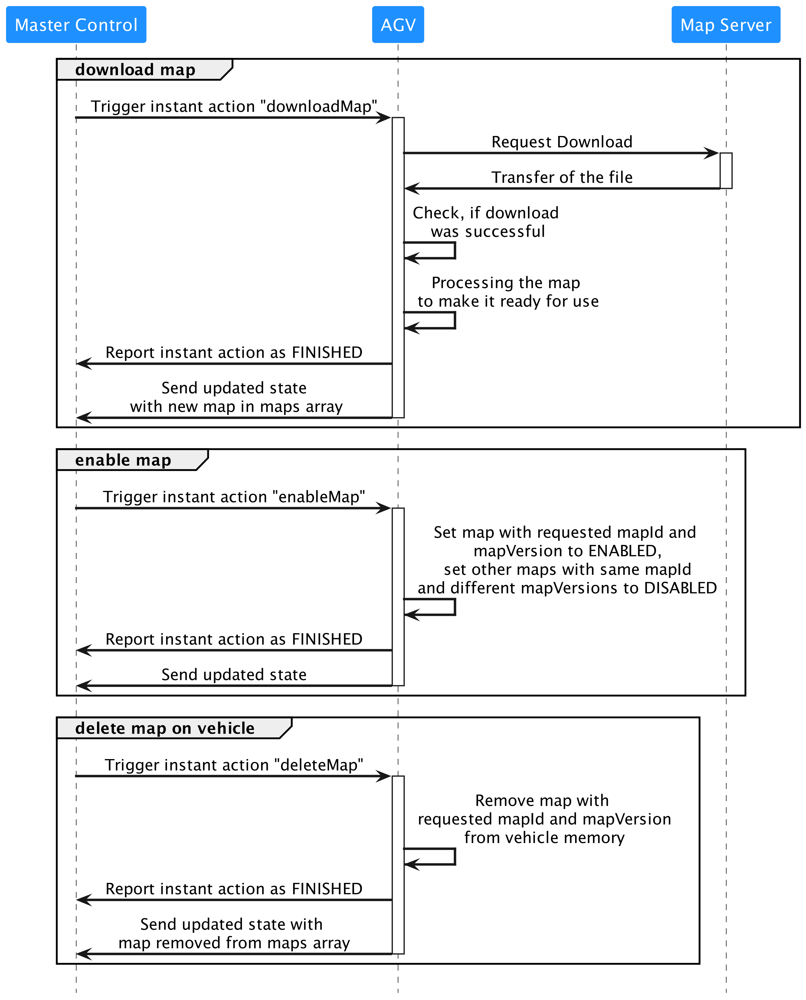
*図13 マップをダウンロード、有効化、削除するためにマスター制御、AGV、マップサーバー間で必要な通信。*

#### 6.7.2 車両状態のマップ

状態の `agvPosition` の `mapId` フィールドは、現在アクティブなマップを表します。車両で利用可能なマップに関する情報は、状態メッセージの構成要素である `maps` 配列に表示されます。この配列の各エントリは、必須フィールド `mapId`、`mapVersion`、および 'ENABLED' または 'DISABLED' のいずれかである `mapStatus` で構成されるJSONオブジェクトです。'ENABLED' マップは必要に応じて車両が使用できます。'DISABLED' マップは使用してはいけません。ダウンロードプロセスのステータスは、現在のアクションが完了していないことによって示されます。エラーも状態で報告されます。

異なる `mapId` を持つ複数のマップを同時に有効にすることができることに注意してください。同じ `mapId` を持つマップの異なるバージョンは一度に1つだけ有効にできます。`maps` 配列が空の場合、これは車両上に現在利用可能なマップがないことを意味します。


#### 6.7.3 マップダウンロード

マップダウンロードは、マスター制御からの `downloadMap` インスタントアクションによってトリガーされます。このコマンドには、必須パラメータ `mapId` とマップサーバー上にマップが保存されている `mapDownloadLink` が含まれており、車両がアクセスできます。

AGVはマップファイルのダウンロードを開始するとすぐに `actionStatus` を 'RUNNING' に設定します。ダウンロードが成功すると、`actionStatus` は 'FINISHED' に更新されます。ダウンロードが失敗した場合、ステータスは 'FAILED' に設定されます。ダウンロードが正常に完了すると、マップは状態の `maps` 配列に追加される必要があります。マップは有効化の準備ができる前に状態で報告されるべきではありません。

マップのダウンロードプロセスが車両上の既存のマップを変更、削除、有効化、または無効化しないことを確認することが重要です。
車両は既に車両上にある `mapId` と `mapVersion` を持つマップのダウンロードを拒否する必要があります。エラーが報告され、インスタントアクションのステータスは 'FAILED' に設定される必要があります。マスター制御はまず車両上のマップを削除してからダウンロードを再開する必要があります。


#### 6.7.4 ダウンロードしたマップの有効化

車両上でマップを有効にする方法は2つあります：

1. **マスター制御がマップを有効化する**：`enableMap` インスタントアクションを使用して、車両上でマップを 'ENABLED' に設定します。同じ `mapId` を持つが異なる `mapVersion` の他のバージョンは 'DISABLED' に設定されます。
2. **車両上でマップを手動で有効にする**：場合によっては、車両上で直接マップを有効にする必要があるかもしれません。結果は車両状態で報告される必要があります。

注文の一部として `nodePosition` 内の対応する `mapId` を送信する際に、車両上で正しいマップが有効化されていることを確認するのはマスター制御の責任です。
車両が新しいマップ上の特定の位置に設定される場合、`initPosition` インスタントアクションが使用されます。


#### 6.7.5 車両上のマップの削除
マスター制御は車両から特定のマップの削除を要求できます。これはインスタントアクション `deleteMap` で行われます。車両のメモリが不足した場合、それをマスター制御に報告すべきであり、マスター制御はその後マップの削除を開始できます。車両自体はマップを削除することが許可されていません。
マップを正常に削除した後、車両の状態のマップ配列からそのマップのエントリを削除することが重要です。


## 6.8 アクション

AGVが走行以外のアクションをサポートする場合、これらのアクションはノードまたはエッジに付加されるアクションフィールドを介して実行されるか、別のトピック「instantActions」（[6.9 トピック「instantActions」](#69-トピック-instantactions-マスターコントロールからagvへ)を参照）を介して送信されます。

エッジ上で実行されるアクションは、AGVがエッジ上にある間のみ実行されます（[6.10.2 ノードの走行とエッジの進入/離脱、アクションのトリガー](#6102-ノードの走行とエッジの進入離脱アクションのトリガー)を参照）。

ノードでトリガーされるアクションは、必要な限り実行し続けることができ、自己終了型であるべきです（例：5秒間続く音声信号や、荷物をピックアップした後に終了するピックアクション）、あるいはペアで定義されるべきです（例：「activateWarningLights」と「deactivateWarningLights」）が、例外もあるかもしれません。

以下のセクションでは、AGVの能力がアクションの説明に対応する場合にAGVが使用すべき事前定義されたアクションを示します。
定義されたパラメータを使用する合理的な方法がある場合は、それらを使用する必要があります。
アクションを正常に実行するために必要であれば、追加のパラメータを定義することができます。

何らかのアクションを以下のセクションのアクションのいずれかにマッピングする方法がない場合、AGVメーカーはマスターコントロールが使用すべき追加のアクションを定義することができます。

### 6.8.1 事前定義されたアクションの定義、パラメータ、効果、適用範囲

一般 | | 適用範囲
:---:|--- | :---:
アクション、カウンターアクション、説明、べき等性、パラメータ | リンクされた状態 | 即時、ノード、エッジ

アクション | カウンターアクション | 説明 | べき等性 | パラメータ | リンクされた状態 | 即時 | ノード | エッジ
---|---|---|---|---|---|---|---|---
startPause | stopPause | 一時停止モードを有効にします。<br>多くのAGVがハードウェアスイッチで一時停止できるため、リンクされた状態が必要です。<br>AGVの走行動作はなし - 次のノードへの到達は必要ありません。<br>アクションは継続できます。<br>オーダーは再開可能です。 | はい | - | paused | はい | いいえ | いいえ
stopPause | startPause | 一時停止モードを無効にします。<br>移動と他のすべてのアクションが再開されます（あれば）。<br>多くのAGVがハードウェアスイッチで一時停止できるため、リンクされた状態が必要です。<br>stopPauseは、startPauseをトリガーしたハードウェアボタンで停止したAGVも再起動できます（設定されている場合）。 | はい | - | paused | はい | いいえ | いいえ
startCharging | stopCharging | 充電プロセスを有効にします。<br>充電は充電スポット（車両停止中）または充電レーン（走行中）で行うことができます。<br>過充電からの保護は車両の責任です。 | はい | - | .batteryState.charging | はい | はい | いいえ
stopCharging | startCharging | 新しいオーダーを送信するために充電プロセスを無効にします。<br>充電プロセスは、バッテリーがいっぱいになるなど、車両/充電ステーションによって中断されることもあります。<br>バッテリー状態は、AGVがオーダーを受信する準備ができている場合にのみ「false」にすることができます。 | はい | - |.batteryState.charging | はい | はい | いいえ
initPosition | - | 指定されたパラメータでAGVの位置をリセット（上書き）します。 | はい | x (float64)<br>y (float64)<br>theta (float64)<br>mapId (string)<br>lastNodeId (string) | .agvPosition.x<br>.agvPosition.y<br>.agvPosition.theta<br>.agvPosition.mapId<br>.lastNodeId<br>.maps | はい | はい<br>（エレベーター） | いいえ
enableMap | - | 新しい位置を初期化せずにオーダーで使用するために、以前にダウンロードしたマップを明示的に有効にします。 | はい | mapId (string)<br>mapVersion (string) | .maps | はい | はい | いいえ
downloadMap | - | 新しいマップのダウンロードをトリガーします。ダウンロード中はアクティブです。エラーは車両状態で報告されます。ダウンロードの成功の確認、マップの使用準備、状態へのマップの設定後に完了します。 | はい | mapId (string)<br>mapVersion (string)<br>mapDownloadLink (string)<br>mapHash (string, オプション) | .maps | はい | いいえ | いいえ
deleteMap | - | 車両メモリからマップの削除をトリガーします。 | はい | mapId (string)<br>mapVersion (string) | .maps | はい | いいえ | いいえ
stateRequest | - | AGVに新しい状態レポートの送信を要求します。 | はい | - | - | はい | いいえ | いいえ
logReport | - | AGVにログレポートの生成と保存を要求します。 | はい | reason<br>(string) | - | はい | いいえ | いいえ
pick | drop<br><br>(自動化された場合) | AGVに荷物のピックアップを要求します。<br>複数の荷役装置を持つAGVは、複数のピック操作を並行して処理できます。<br>この場合、パラメータlhdが存在する必要があります（例：LHD1）。<br>stationTypeパラメータは、ピック操作の詳細な処理方法を通知します（例：床位置、ラック位置、パッシブコンベア、アクティブコンベアなど）。<br>ロードタイプは荷物のユニットについて通知し、例えばフィールドの切り替えに使用できます（例：EPAL、INDUなど）。<br>荷役装置の準備（例：高さパラメータに基づく事前リフト操作）のために、アクションを事前にホライズンで告知することができます。<br>ただし、事前リフト操作などは、関連するノードがまだリリースされていないため、AGV状態で「RUNNING」として報告されません。<br>エッジ上では、車両はセンシングデバイスを使用してノードをピックアップする位置を検出できます。 | いいえ |lhd (string, オプション)<br>stationType (string)<br>stationName(string, オプション)<br>loadType (string) <br>loadId(string, オプション)<br>height (float64) (オプション)<br>床に関連する荷物の底面を定義<br>depth (float64) (オプション) フォークリフト用<br>side(string) (オプション) 例：コンベア | .load | いいえ | はい | はい
drop | pick<br><br>(自動化された場合) | AGVに荷物の降ろしを要求します。<br>詳細については、アクションpickを参照してください。 | いいえ | lhd (string, オプション)<br>stationType (string, オプション)<br>stationName (string, オプション)<br>loadType (string, オプション)<br>loadId(string, オプション)<br>height (float64, オプション)<br>depth (float64, オプション) <br>… | .load | いいえ | はい | はい
detectObject | - | AGVがオブジェクト（例：荷物、充電スポット、空き駐車位置）を検出します。 | はい | objectType(string, オプション) | - | いいえ | はい | はい
finePositioning | - | ノード上では、AGVはターゲット上に正確に位置決めします。<br>AGVはノード位置から逸脱することが許可されています。<br>エッジ上では、AGVはエッジを走行中に例えば固定設備に合わせます。<br>InstantAction：AGVはターゲット上に正確に位置決めを開始します。 | はい | stationType(string, オプション)<br>stationName(string, オプション) | - | いいえ | はい | はい
waitForTrigger | - | AGVはAGV上のトリガー（例：ボタン押下、手動積載）を待機する必要があります。<br>マスターコントロールはタイムアウトを処理する責任があり、必要に応じてオーダーをキャンセルする必要があります。 | はい | triggerType(string) | - | いいえ | はい | いいえ
cancelOrder | - | AGVは可能な限り早く停止します。<br>これは即時または次のノードで行われる可能性があります。<br>その後、オーダーは削除されます。すべてのアクションはキャンセルされます。 | はい | - | - | はい | いいえ | いいえ
factsheetRequest | - | AGVにファクトシートの送信を要求します | はい | - | - | はい | いいえ | いいえ


### 6.8.2 事前定義されたアクションの状態

アクション | アクション状態
---|:---:
 | | 'INITIALIZING', 'RUNNING', 'PAUSED', 'FINISHED', 'FAILED' |

アクション | 'INITIALIZING' | 'RUNNING' | 'PAUSED' | 'FINISHED' | 'FAILED'
---|---|---|---|---|---
startPause | - | モードの有効化準備中。<br>AGVが即時遷移をサポートしている場合、この状態は省略できます。 | - | 車両は静止状態。<br>すべてのアクションは一時停止します。<br>一時停止モードが有効になっています。<br>AGVは.paused: "true"を報告します。 | 一時停止モードが何らかの理由で有効化できません（例：ハードウェアスイッチによる上書き）。
stopPause | - | モードの無効化準備中。<br>AGVが即時遷移をサポートしている場合、この状態は省略できます。 | - | 一時停止モードが無効化されています。<br>一時停止されていたすべてのアクションが再開されます。<br>AGVは.paused: "false"を報告します。 | 一時停止モードが何らかの理由で無効化できません（例：ハードウェアスイッチによる上書き）。
startCharging | - | 充電プロセスの有効化進行中（充電器との通信実行中）。<br>AGVが即時遷移をサポートしている場合、この状態は省略できます。 | - | 充電プロセスが開始されました。<br>AGVは.batteryState.charging: "true"を報告します。 | 充電プロセスが何らかの理由で開始できませんでした（例：充電器に合わせていない）。充電問題はエラーと対応する必要があります。
stopCharging | - | 充電プロセスの無効化進行中（充電器との通信実行中）。<br>AGVが即時遷移をサポートしている場合、この状態は省略できます。 | - | 充電プロセスが停止しました。<br>AGVは.batteryState.charging: "false"を報告します | 充電プロセスが何らかの理由で停止できませんでした（例：充電器に合わせていない）。<br>充電問題はエラーと対応する必要があります。
initPosition | - | 新しい位置の初期化進行中（信頼性チェックなど）。<br>AGVが即時遷移をサポートしている場合、この状態は省略できます。 | - | 位置がリセットされました。<br>AGVは<br>.agvPosition.x = x, <br>.agvPosition.y = y, <br>.agvPosition.theta = theta <br>.agvPosition.mapId = mapId <br>.agvPosition.lastNodeId = lastNodeIdを報告します | 位置が無効であるか、リセットできません。<br>一般的な位置特定問題はエラーと対応する必要があります。
| downloadMap | マップサーバーへの接続を初期化します。 | AGVはダウンロードが完了するまでマップをダウンロードしています。 | - | AGVはmapId/mapVersionと対応するmapStatusを'DISABLED'に設定して状態を更新します。 | ダウンロードが失敗し、車両状態で更新されました（例：接続が失われた、マップサーバーに到達できない、mapId/mapVersionがマップサーバー上に存在しない）。 |
| enableMap | - | AGVは要求されたmapIdとmapVersionのマップを有効にし、同じmapIdの他のバージョンを無効にします。 | - | AGVは要求されたマップの対応するmapStatusを'ENABLED'に、同じmapIdの他のバージョンを'DISABLED'に更新します。 | 要求されたmapId/mapVersionの組み合わせが存在しません。|
| deleteMap | - | AGVは要求されたmapIdとmapVersionのマップを内部メモリから削除します。 | - | AGVは状態からmapId/mapVersionを削除します。 | マップが現在使用中の場合、削除できません。要求されたmapId/mapVersionの組み合わせは以前に既に削除されています。 |
stateRequest | - | - | - | 状態が通信されました | -
logReport | - | レポートの生成中。<br>AGVが即時生成をサポートしている場合、この状態は省略できます。 | - | レポートが保存されました。<br>ログの名前は状態で報告されます。 | レポートが保存できません（例：空き容量がない）。
pick | ピックプロセスの初期化、例：待機中のリフト操作。 | ピックプロセスの実行中（AGVがステーションに進入中、荷役装置が稼働中、ステーションとの通信実行中など）。 | ピックプロセスが一時停止中、例：安全フィールドが違反された場合。<br>違反が解除された後、ピックプロセスは継続します。 | ピックが完了。<br>荷物がAGVに入り、AGVは新しい荷物状態を報告します。 | ピックが失敗、例：ステーションが予期せず空。<br>失敗したピック操作はエラーと対応する必要があります。
drop | ドロッププロセスの初期化、例：待機中のリフト操作。 | ドロッププロセスの実行中（AGVがステーションに進入中、荷役装置が稼働中、ステーションとの通信実行中など）。 | ドロッププロセスが一時停止中、例：安全フィールドが違反された場合。<br>違反が解除された後、ドロッププロセスは継続します。 | ドロップが完了。<br>荷物がAGVから離れ、AGVは新しい荷物状態を報告します。 | ドロップが失敗、例：ステーションが予期せず占有されている。<br>失敗したドロップ操作はエラーと対応する必要があります。
detectObject | - | オブジェクト検出実行中。 | - | オブジェクトが検出されました。 | AGVがオブジェクトを検出できませんでした。
finePositioning | - | AGVがターゲット上に正確に位置決めしています。 | 細かな位置決めプロセスが一時停止中、例：安全フィールドが違反された場合。<br>違反が解除された後、細かな位置決めは継続します。 | ステーションに対する目標位置に到達しました。 | ステーションに対する目標位置に到達できませんでした。
waitForTrigger | - | AGVはトリガーを待機中です | - | トリガーがトリガーされました。 | オーダーがキャンセルされた場合、waitForTriggerは失敗します。
cancelOrder | - | AGVは停止中または次のノードに到達するまで走行中です。 | - | AGVは静止状態でオーダーをキャンセルしました。 | -
factsheetRequest | - | - | - | ファクトシートが通信されました | -


## 6.9 トピック "instantActions"（マスターコントロールからAGVへ）

特定の場合には、AGVに即時実行する必要があるアクションを送信する必要があります。
これは「instantActions」トピックに「instantAction」メッセージを公開することで可能になります。
これらはAGVの現在のオーダーの内容と競合してはいけません（例：オーダーがフォークを上げるよう指示している間に、フォークを下げるinstantAction）。

instantActionsが関連する可能性のある例：
- 現在のオーダーを変更せずにAGVを一時停止する
- 一時停止後にオーダーを再開する
- 信号（光学的、音声など）を有効にする

追加情報については、[7 ベストプラクティス](#7-ベストプラクティス)セクションを参照してください。

オブジェクト構造 | データ型 | 説明
---|---|---
headerId | uint32 | メッセージのヘッダーID。<br>ヘッダーIDはトピックごとに定義され、送信されるメッセージごとに1ずつ増加します（必ずしも受信されるとは限りません）。
timestamp | string | タイムスタンプ（ISO 8601、UTC）；YYYY-MM-DDTHH:mm:ss.ffZ（例："2017-04-15T11:40:03.12Z"）
version | string | プロトコルのバージョン [Major].[Minor].[Patch]（例：1.3.2）。
manufacturer | string | AGVの製造元。
serialNumber | string | AGVのシリアル番号。
actions [action] | array | 即時実行する必要があり、通常のオーダーの一部ではないアクションの配列。

AGVが「instantAction」を受信すると、適切な「actionStatus」がAGVの状態の「actionStates」配列に追加されます。
「actionStatus」はアクションの進行状況に応じて更新されます。
「actionStatus」の異なる遷移については、図16も参照してください。


## 6.10 トピック "state"（AGVからマスターコントロールへ）

AGV状態は1つのトピックでのみ送信されます。
別々のメッセージ（例：オーダー、バッテリー状態、エラー）を使用する場合と比較して、1つのトピックを使用することで、メッセージを処理するブローカーとマスターコントロールの作業負荷を削減し、AGV状態に関する情報を同期させておくことができます。

AGV状態メッセージは、関連イベントの発生時またはMQTTブローカーを通じて遅くとも30秒ごとにマスターコントロールに公開されます。

状態メッセージの送信をトリガーするイベント：
- オーダーの受信
- オーダー更新の受信
- 荷物状態の変更
- エラーまたは警告
- ノード上の走行
- 運転モードの切り替え
- 「driving」フィールドの変更
- 「nodeStates」、「edgeStates」または「actionStates」の変更
- 「maps」フィールドの変更

通信量を抑える努力をすべきです。
2つのイベントが互いに相関する場合（例：新しいオーダーの受信は通常「nodeStates」と「edgeStates」の更新を強制します；ノード上の走行も同様）、複数の更新ではなく1つの状態更新をトリガーすることが賢明です。


### 6.10.1 概念とロジック

オーダーの進捗は「nodeStates」と「edgeStates」によって追跡されます。
さらに、AGVが現在の位置を導出できる場合は、「position」フィールドを通じてその位置を公開できます。

AGVが自身でパスを計画する場合、マスターコントロールがこのフィールドを使用できない場合を除き、統合時にこのフィールドを送信しないことが合意されていない限り、計算された軌跡（ベースとホライズンを含む）をNURBSの形式で状態メッセージの「trajectory」オブジェクトを通じて通信する必要があります。
ノードがマスターコントロールによってリリースされた後、AGVはその軌跡を変更することはできません。

「nodeStates」と「edgeStates」には、AGVがまだ走行する必要があるすべてのノード/エッジが含まれます。

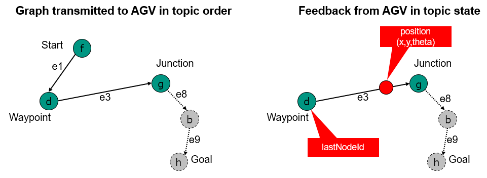
>図14 stateトピックによって提供されるオーダー情報。最後のノードのIDと残りのノードとエッジのみが送信される


### 6.10.2 ノードの走行とエッジの進入/離脱、アクションのトリガー

AGVは、ノードをいつ走行したとみなすかを自分で決定します。
一般的に、AGVの制御点はノードの「allowedDeviationXY」内にあり、その向きは「allowedDeviationTheta」内にあるべきです。
後続のエッジ属性「corridor」が設定されている場合、これらの境界も追加で満たす必要があります。

AGVは、「nodeStates」配列からその「nodeState」を削除し、「lastNodeId」、「lastNodeSequenceId」を走行したノードの値に設定することでノードの走行を報告します。

AGVがノードを走行したと報告すると同時に、AGVはノードに関連付けられたアクション（もしあれば）をトリガーする必要があります。

ノードの走行は、ノードまでのエッジを離れることも示します。
エッジは「edgeStates」から削除され、エッジ上でアクティブだったアクションは終了する必要があります。

ノードの走行はまた、AGVが次のエッジに進入する瞬間も示します（エッジがある場合）。
エッジのアクションは今トリガーされるべきです。
この規則の例外は、AGVがエッジ上で一時停止しなければならない場合（ソフトまたはハードブロッキングエッジのため、またはその他の理由のため）- この場合、AGVは再び移動し始めた後にエッジに進入します。

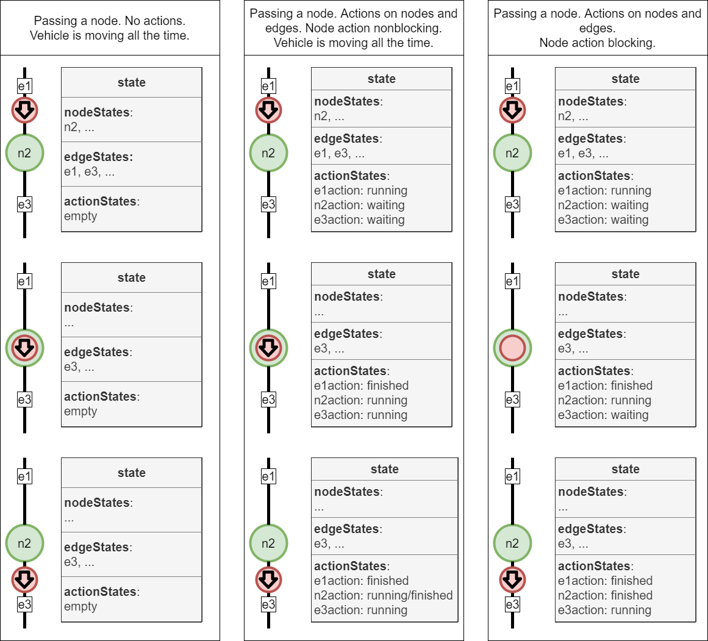
>図15 オーダー処理中の「nodeStates」、「edgeStates」、および「actionStates」の描写


### 6.10.3 ベースリクエスト

AGVがベースが低くなっていることを検出した場合、不要なブレーキを防ぐために「newBaseRequest」フラグを「true」に設定できます。


### 6.10.4 情報

AGVは「information」配列を通じてマスターコントロールに任意の追加情報を提出できます。
情報メッセージを通じて情報を報告する期間はAGV次第です。

マスターコントロールはロジックにinfo messagesを使用してはならず、視覚化およびデバッグ目的にのみ使用する必要があります。


### 6.10.5 エラー

AGVは「errors」配列を通じてエラーを報告します。
エラーには2つのレベルがあります：'WARNING'と'FATAL'。
'WARNING'は自己解決するエラーです（例：フィールド違反）。
'FATAL'エラーは人間の介入が必要です。
エラーは「errorReferences」配列を通じてエラーの原因を見つけるのに役立つ参照を渡すことができます。


### 6.10.6 状態メッセージの実装

オブジェクト構造 | 単位 | データ型 | 説明
---|---|---|---
headerId | | uint32 | メッセージのヘッダーID。<br>ヘッダーIDはトピックごとに定義され、送信されるメッセージごとに1ずつ増加します（必ずしも受信されるとは限りません）。
timestamp | | string | タイムスタンプ（ISO 8601、UTC）；YYYY-MM-DDTHH:mm:ss.ffZ（例："2017-04-15T11:40:03.12Z"）。
version | | string | プロトコルのバージョン [Major].[Minor].[Patch]（例：1.3.2）。
manufacturer | | string | AGVの製造元。
serialNumber | | string | AGVのシリアル番号。
*maps[map]* | | array | 現在車両に保存されているマップオブジェクトの配列。
orderId| | string | 現在のオーダーまたは前回完了したオーダーの一意のオーダー識別子。<br>新しいオーダーが受信されるまで、orderIdは保持されます。<br>前回のorderIdが利用できない場合は空の文字列（""）。
orderUpdateId | | uint32 | オーダー更新がAGVによって受け入れられたことを識別するオーダー更新識別子。<br>前回のorderUpdateIdが利用できない場合は"0"。
*zoneSetId* | |string | AGVが現在パス計画に使用しているゾーンセットの一意のID。<br>オーダーで使用されたものと同じである必要があります。<br><br>オプション：AGVがゾーンを使用しない場合、このフィールドは省略できます。
lastNodeId | | string | 最後に到達したノードのノードID、またはAGVが現在ノード上にある場合は現在のノード（例：「node7」）。lastNodeIdが利用できない場合は空の文字列（""）。
lastNodeSequenceId | | uint32 | 最後に到達したノードのシーケンスID、またはAGVが現在ノード上にある場合は現在のノードのシーケンスID。<br>lastNodeSequenceIdが利用できない場合は"0"。
**nodeStates [nodeState]** | |array | オーダーを実行するために走行する必要があるnodeStateオブジェクトの配列<br>（アイドル時は空の配列）
**edgeStates [edgeState]** | |array | オーダーを実行するために走行する必要があるedgeStateオブジェクトの配列<br>（アイドル時は空の配列）
***agvPosition*** | | JSONオブジェクト | マップ上のAGVの現在位置。<br><br>オプション：自己位置特定能力のないAGV（例：ライン誘導AGV）の場合のみ省略可能。
***velocity*** | | JSONオブジェクト | 車両座標におけるAGVの速度。
***loads [load]*** | | array | 現在AGVによって処理されている荷物。<br><br>オプション：AGVが荷物状態を判断できない場合、このフィールドは完全に省略され、空の配列として報告されるべきではありません。<br>AGVが荷物状態を判断できるが、配列が空の場合、AGVは積載されていないと見なされます。
driving | | boolean | "true"：AGVが走行中かつ/または回転中であることを示します。AGVの他の動き（例：リフト動作）はここに含まれません。<br>"false"：AGVが走行も回転もしていないことを示します。
*paused* | | boolean | "true"：AGVは現在一時停止状態にあります。これはAGV上の物理ボタンの押下またはinstantActionによるものです。<br>AGVはオーダーを再開できます。<br><br>"false"：AGVは現在一時停止状態にありません。
*newBaseRequest* | | boolean | "true"：AGVはベースの終わりに近づいており、新しいベースが送信されなければ速度を落とします。<br>マスターコントロールが新しいベースを送信するためのトリガーです。<br><br>"false"：ベース更新は不要です。
*distanceSinceLastNode* | meter | float64 | ライン誘導車両が、lastNodeIdから走行した距離を示すために使用されます。<br>距離はメートル単位です。
**actionStates [actionState]** | | array | 現在のオーダーと前回のオーダー以降に受信したすべてのinstantActionsからのすべてのアクションの配列を含みます。アクション状態は新しいオーダーが受信されるまで保持されます。実行中のinstantActionを除くアクション状態は、新しいオーダーの受信時に削除されます。<br>これには、進行中の前のノードからのアクションが含まれる場合があります。<br><br>アクションが完了すると、actionStatusが'FINISHED'に設定され、該当する場合はresultDescriptionを含む更新された状態メッセージが公開されます。
**batteryState** | | JSONオブジェクト | バッテリー関連のすべての情報を含みます。
operatingMode | | string | 列挙型 {'AUTOMATIC', 'SEMIAUTOMATIC', 'MANUAL', 'SERVICE', 'TEACHIN'}<br>追加情報については、[6.10.6 状態メッセージの実装](#6106-状態メッセージの実装)のセクションの表1を参照してください。
**errors [error]** | | array | errorオブジェクトの配列。<br>AGVのすべてのアクティブなエラーが配列に含まれるべきです。<br>空の配列はAGVにアクティブなエラーがないことを示します。
***information [info]*** | | array | infoオブジェクトの配列。<br>空の配列はAGVに情報がないことを示します。<br>これは視覚化またはデバッグのみに使用されるべきであり、マスターコントロールのロジックには使用されるべきではありません。
**safetyState** | | JSONオブジェクト | 安全性関連のすべての情報を含みます。

オブジェクト構造 | 単位 | データ型 | 説明
---|---|---|---
**map**{ | | JSONオブジェクト|
mapId | | string | 車両の作業空間の定義された領域を記述するマップのID。
mapVersion | | string | マップのバージョン。
*mapDescription* | | string | マップに関する追加情報。
mapStatus <br>}| | string | 列挙型 {'ENABLED', 'DISABLED'}<br>'ENABLED'：このマップが現在AGV上でアクティブ／使用中であることを示します。同じmapIdを持つマップは最大で1つだけステータスが'ENABLED'に設定できます。<br>'DISABLED'：このマップバージョンが現在AGV上で有効化されていないため、要求によって有効化または削除できることを示します。

オブジェクト構造 | 単位 | データ型 | 説明
---|---|---|---
**nodeState** { | JSONオブジェクト | |
nodeId | | string | 一意のノード識別子。
sequenceId | | uint32 | 同じnodeIdを持つ複数のノードを区別するためのシーケンスID。
*nodeDescription* | | string | ノードに関する追加情報。
released| | boolean | "true"はノードがベースの一部であることを示します。<br>"false"はノードがホライズンの一部であることを示します。
***nodePosition***<br><br>}| | JSONオブジェクト | ノード位置。<br>オブジェクトは[6.6 トピック「order」](#66-トピック-order-マスターコントロールからagvへ)のセクションで定義されています。<br>オプション：<br>マスターコントロールはこの情報を持っています。<br>例えばデバッグ目的で追加送信できます。

オブジェクト構造 | 単位 | データ型 | 説明
---|---|---|---
**edgeState** { | | JSONオブジェクト | |
edgeId | | string | 一意のエッジ識別子。
sequenceId | | uint32 | 同じedgeIdを持つ複数のエッジを区別するためのシーケンスID。
*edgeDescription* | | string | エッジに関する追加情報。
released | | boolean | "true"はエッジがベースの一部であることを示します。<br>"false"はエッジがホライズンの一部であることを示します。
***trajectory*** <br><br>} | | JSONオブジェクト | 軌跡はNURBSとして通信され、[6.6.6 オーダーメッセージの実装](#666-オーダーメッセージの実装)のセクションで定義されています。<br><br>軌跡セグメントは車両がエッジに進入する点から始まり、車両がエンドノードを走行したと報告する点で終了します。

オブジェクト構造 | 単位 | データ型 | 説明
---|---|---|---
**agvPosition** { | | JSONオブジェクト | 世界座標のマップ上の位置を定義します。各フロアには独自のマップがあります。
positionInitialized | | boolean | "true"：位置が初期化されています。<br>"false"：位置が初期化されていません。
*localizationScore* | | float64 | 範囲：[0.0 ... 1.0]<br><br>位置特定の品質を記述し、したがって例えばSLAM AGVが現在の位置情報がどれほど正確かを記述するために使用できます。<br><br>0.0：位置不明<br>1.0：位置既知<br><br>位置特定スコアを見積もれない車両ではオプションです。<br><br>ログと視覚化目的のみです。
*deviationRange* | m | float64 | メートル単位での位置の偏差範囲の値。<br><br>例えばグリッドベースの位置特定など、偏差を見積もれない車両ではオプションです。<br><br>ログと視覚化目的のみです。
x | m | float64 | マップ座標系を基準としたマップ上のX位置。<br>精度は特定の実装次第です。
y | m | float64 | マップ座標系を基準としたマップ上のY位置。<br>精度は特定の実装次第です。
theta | | float64 | 範囲：[-Pi ... Pi]<br><br>AGVの向き。
mapId | | string | 位置が参照されるマップの一意の識別子。<br><br>各マップには同じ座標原点があります。<br>AGVが出発フロアから目的地フロアへエレベーターを使用する場合、出発フロアのマップを離れ、目的地フロアのマップの対応するエレベーターノードに出現します。
*mapDescription*<br>} | | string | マップに関する追加情報。

オブジェクト構造 | 単位 | データ型 | 説明
---|---|---|---
**velocity** { | | JSONオブジェクト |
*vx* | m/s | float64 | AGVのX方向の速度。
*vy* | m/s | float64 | AGVのY方向の速度。
*omega*<br>}| Rad/s | float64 | AGVのZ軸周りの回転速度。

オブジェクト構造 | 単位 | データ型 | 説明
---|---|---|---
**load** { | | JSONオブジェクト |
*loadId* | | string | 荷物の一意の識別子（例：バーコードまたはRFID）。<br><br>AGVが荷物を識別できるが、まだ識別していない場合は空のフィールド。<br><br>AGVが荷物を識別できない場合はオプション。
*loadType* | | string | 荷物のタイプ。
*loadPosition* | | string | AGVのどの荷役/運搬ユニットが使用されているかを示します。例えば、AGVが荷物を運ぶための複数のスポット/位置を持っている場合。<br><br>例：「front」、「back」、「positionC1」など。<br><br>loadPositionが1つしかない車両ではオプション
***boundingBoxReference*** | | JSONオブジェクト | バウンディングボックスの位置の基準点。<br>基準点は常にバウンディングボックスの底面（height = 0）の中心であり、AGVの座標系で記述されます。
***loadDimensions*** | | JSONオブジェクト | メートル単位の荷物のバウンディングボックスの寸法。
*weight*<br>} | kg | float64 | 範囲：[0.0 ... float64.max]<br><br>kg単位で測定された荷物の絶対重量。

オブジェクト構造 | 単位 | データ型 | 説明
---|---|---|---
**boundingBoxReference** { | | JSONオブジェクト | バウンディングボックスの位置の基準点。<br>基準点は常にバウンディングボックスの底面（height = 0）の中心であり、AGVの座標系で記述されます。
x | | float64 | 基準点のX座標。
y | | float64 | 基準点のY座標。
z | | float 64 | 基準点のZ座標。
*theta*<br> } | | float64 | 荷物のバウンディングボックスの向き。<br>牽引車両、列車などでは重要です。

オブジェクト構造 | 単位 | データ型 | 説明
---|---|---|---
**loadDimensions** { | | JSONオブジェクト | メートル単位の荷物のバウンディングボックスの寸法。
length | m | float64 | 荷物のバウンディングボックスの絶対長さ。
width | m | float64 | 荷物のバウンディングボックスの絶対幅。
*height* <br>}| m | float64 | 荷物のバウンディングボックスの絶対高さ。<br><br>オプション：<br><br>値を設定するのは既知の場合のみです。

オブジェクト構造 | 単位 | データ型 | 説明
---|---|---|---
**actionState** { | | JSONオブジェクト |
actionId | |string | アクションの一意の識別子。
*actionType* | | string | アクションのタイプ。<br><br>オプション：情報提供または視覚化目的のみ。マスターコントロールはオーダーで送信したアクションタイプを認識しています。
*actionDescription* | | string | 現在のアクションに関する追加情報。
actionStatus | | string | 列挙型 {'WAITING', 'INITIALIZING', 'RUNNING', 'PAUSED', 'FINISHED', 'FAILED'}<br><br>[6.11 actionStates](#611-actionstates)セクションを参照してください。
*resultDescription*<br>} | | string | 結果の説明、例：RFIDリーディングの結果。<br><br>エラーはerrorsで送信されます。

オブジェクト構造 | 単位 | データ型 | 説明
---|---|---|---
**batteryState** { | | JSONオブジェクト | 
batteryCharge | % | float64 | 充電状態：<br>AGVが良好または不良のバッテリーレベルの値のみを提供する場合、これらは20%（不良）および80%（良好）として示されます。
*batteryVoltage* | V | float64 | バッテリー電圧。
*batteryHealth* | % | int8 | 範囲：[0 ... 100]<br><br>バッテリーの健全性を記述する状態。
charging | | boolean | "true"：充電中。<br>"false"：AGVは現在充電していません。
*reach* <br>}| m | uint32 | 範囲：[0 ... uint32.max]<br><br>現在の充電状態での推定到達距離。

オブジェクト構造 | 単位 | データ型 | 説明
---|---|---|---
**error** { | | JSONオブジェクト |
errorType | | string | エラーのタイプ/名前
***errorReferences [errorReference]*** | | array | エラーに関連する詳細情報を提供するための参照の配列（例：nodeId、edgeId、orderId、actionIdなど）。<br>追加情報については[7 ベストプラクティス](#7-ベストプラクティス)を参照してください。
*errorDescription* | | string | エラーの詳細と考えられる原因の詳細な説明。
*errorHint* | | string | 報告されたエラーへの対処または解決に関するヒント。
errorLevel <br> }| | string | 列挙型 {'WARNING', 'FATAL'}<br><br>'WARNING'：AGVは開始準備ができています（例：メンテナンスサイクル期限切れ警告）。<br>'FATAL'：AGVは稼働状態ではなく、ユーザーの介入が必要です（例：レーザースキャナーが汚れています）。

オブジェクト構造 | 単位 | データ型 | 説明
---|---|---|---
**errorReference** { | | JSONオブジェクト |
referenceKey | | string | 使用される参照のタイプを指定します（例：nodeId、edgeId、orderId、actionIdなど）。
referenceValue <br>} | | string | 参照キーに属する値。例えば、エラーが発生したノードのID。

オブジェクト構造 | 単位 | データ型 | 説明
---|---|---|---
**info** { | | JSONオブジェクト |
infoType | | string | 情報のタイプ/名前。
*infoReferences [infoReference]* | | array | 参照の配列。
*infoDescription* | | string | 情報の説明。
infoLevel <br>}| | string | 列挙型 {'DEBUG', 'INFO'}<br><br>'DEBUG'：デバッグに使用。<br> 'INFO'：視覚化に使用。

オブジェクト構造 | 単位 | データ型 | 説明
---|---|---|---
**infoReference** { | | JSONオブジェクト |
referenceKey | | string | 参照のタイプ（例：headerId、orderId、actionIdなど）を参照します。
referenceValue <br>} | | string | 参照キーに属する値を参照します。

オブジェクト構造 | 単位 | データ型 | 説明
---|---|---|---
**safetyState** { | | JSONオブジェクト |
eStop | | string | 列挙型 {'AUTOACK', 'MANUAL', 'REMOTE', 'NONE'}<br><br>e-Stopの確認タイプ：<br>'AUTOACK'：自動確認可能なe-stopが有効、例：バンパーまたは保護フィールドによる。<br>'MANUAL'：e-stopは車両で手動確認が必要。<br>'REMOTE'：施設のe-stopは遠隔確認が必要。<br>'NONE'：e-stop非アクティブ。
fieldViolation<br>} | | boolean | 保護フィールド違反。<br>"true"：フィールドが違反されています<br>"false"：フィールドは違反されていません。

#### 運転モードの説明
以下の説明はトピック「state」のoperatingModeをリストアップしています。

識別子 | 説明
---|---
AUTOMATIC | AGVはマスターコントロールの完全な制御下にあります。<br>AGVはマスターコントロールからのオーダーに基づいて走行しアクションを実行します。
SEMIAUTOMATIC | AGVはマスターコントロールの制御下にあります。<br>AGVはマスターコントロールからのオーダーに基づいて走行しアクションを実行します。<br>走行速度はHMIによって制御されます（速度は自動モードの速度を超えることはできません）。<br>操舵は自動制御下にあります（非安全HMI可能）。
MANUAL | マスターコントロールはAGVを制御していません。<br>スーパーバイザーはAGVに走行オーダーやアクションを送信しません。<br>HMIを使用してAGVの操舵、速度、取扱装置を制御できます。<br>AGVの位置はマスターコントロールに送信されます。<br>AGVがこのモードに入るか離れると、すべてのオーダーをすぐにクリアします（安全HMI必須）。
SERVICE | マスターコントロールはAGVを制御していません。<br>マスターコントロールはAGVに走行オーダーやアクションを送信しません。<br>権限のある人員がAGVを再設定できます。
TEACHIN | マスターコントロールはAGVを制御していません。<br>スーパーバイザーはAGVに走行オーダーやアクションを送信しません。<br>AGVは教示中です、例：マッピングがマスターコントロールによって行われています。

>表1 運転モードとその意味


## 6.11 アクション状態

AGVが`action`（`node`や`edge`に付加されたものか、`instantAction`を介したもの）を受信すると、その`action`を`actionStates`配列内の`actionState`で表現する必要があります。

`actionStates`は`actionStatus`フィールドでアクションのライフサイクルの段階を記述します。

表2は、列挙型`actionStatus`が保持できる値を説明しています。

actionStatus | 説明
---|---
'WAITING' | アクションはAGVによって受信されたが、それをトリガーするノードにまだ到達していないか、それがアクティブとなるエッジにまだ進入していない。
'INITIALIZING' | アクションがトリガーされ、準備措置が開始された。
'RUNNING' | アクションが実行中。
'PAUSED' | アクションは一時停止instantActionまたは外部トリガー（AGVの一時停止ボタン）のために一時停止されている。
'FINISHED' | アクションは完了した。<br>結果はresultDescriptionを通じて報告される。
'FAILED' | アクションは何らかの理由で完了できなかった。

>表2 actionStatusフィールドの受け入れ可能な値

状態遷移図は図16に示されています。

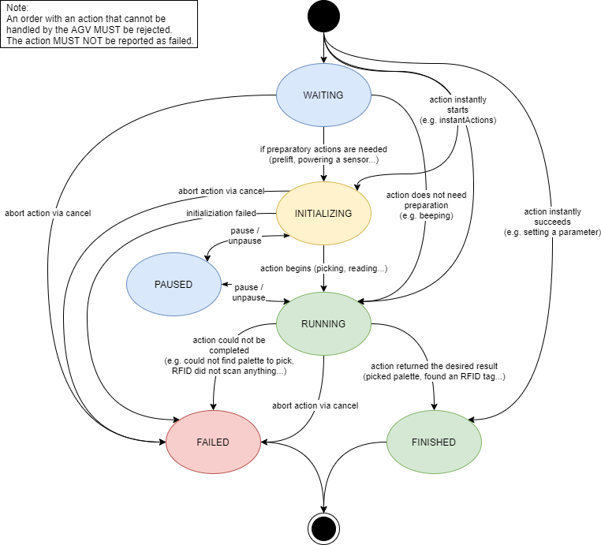
>図16 actionStatesのすべての可能な状態遷移


## 6.12 アクションブロッキングタイプとシーケンス

リスト内の複数のアクションの順序は、それらのアクションが実行されるべきシーケンスを定義します。
アクションの並列実行は、それぞれの`blockingType`によって統治されます。

アクションには3つの異なるブロッキングタイプがあり、表3に説明されています。

blockingType | 説明
---|---
NONE | アクションは他のアクションと並行して、また車両の走行中に実行できます。
SOFT | アクションは他のアクションと並行して実行できます。車両は走行してはいけません。
HARD | アクションは他のアクションと並行して実行されるべきではありません。車両は走行してはいけません。

>表3 アクションブロッキングタイプ

同じノード上に異なるブロッキングタイプを持つ複数のアクションがある場合、図17はAGVがこれらのアクションをどのように処理すべきかを説明しています。

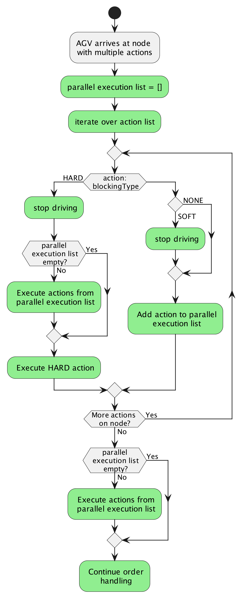
>図17 複数のアクションの処理


## 6.13 トピック "visualization"

ほぼリアルタイムの位置更新のために、AGVはトピック`visualization`上にその位置と速度をブロードキャストできます。

位置オブジェクトの構造は、状態内の位置および速度オブジェクトと同じです。
追加情報については、車両状態の[6.10.6 状態メッセージの実装](#6106-状態メッセージの実装)セクションを参照してください。
このトピックの更新レートはインテグレーターによって定義されます。


## 6.14 トピック "connection"

AGVクライアントがブローカーに接続する際、AGVクライアントがブローカーから切断された際にブローカーによって公開される最終意思トピックとメッセージを設定できます。
したがって、マスターコントロールはすべてのAGVの接続トピックを購読することで切断イベントを検出できます。
切断はブローカーとクライアント間で交換されるハートビートを介して検出されます。
間隔はほとんどのブローカーで設定可能であり、約15秒に設定する必要があります。
`connection`トピックのサービス品質レベルは1 - 少なくとも1回 でなければなりません。

提案される最終意思トピック構造は以下の通りです：

**uagv/v2/manufacturer/SN/connection**

最終意思メッセージは以下のフィールドを持つJSON形式のメッセージとして定義されます：

識別子 | データ型 | 説明
---|---|---
headerId | uint32 | メッセージのヘッダーID。<br>ヘッダーIDはトピックごとに定義され、送信されるメッセージごとに1ずつ増加します（必ずしも受信されるとは限りません）。
timestamp | string | タイムスタンプ（ISO8601、UTC）；YYYY-MM-DDTHH:mm:ss.ffZ（例："2017-04-15T11:40:03.12Z"）。
version | string | プロトコルのバージョン [Major].[Minor].[Patch]（例：1.3.2）。
manufacturer | string | AGVの製造元。
serialNumber | string | AGVのシリアル番号。
connectionState | string | 列挙型 {'ONLINE', 'OFFLINE', 'CONNECTIONBROKEN'}<br><br>'ONLINE'：AGVとブローカー間の接続がアクティブです。<br><br>'OFFLINE'：AGVとブローカー間の接続が調整された方法でオフラインになりました。<br><br>'CONNECTIONBROKEN'：AGVとブローカー間の接続が予期せず終了しました。

最終意思メッセージは、MQTT切断コマンドを使用して接続が正常に終了した場合には送信されません。
最終意思メッセージは、接続が予期せず中断された場合にのみブローカーによって送信されます。

**注**：MQTTの最終意思機能の性質上、最終意思メッセージはAGVとMQTTブローカー間の接続フェーズで定義されます。
その結果、タイムスタンプとheaderIdフィールドは常に古いものになります。

AGVが正常に切断したい場合：

1. AGVは`connectionState`を`OFFLINE`に設定して"uagv/v2/manufacturer/SN/connection"を送信します。
2. 切断コマンドでMQTT接続を切断します。

AGVがオンラインになる場合：

1. MQTT接続が作成されるとき、`connectionState`フィールドを`CONNECTIONBROKEN`に設定して最終意思を"uagv/v2/manufacturer/SN/connection"に設定します。
2. `connectionState`を`ONLINE`に設定してトピック"uagv/v2/manufacturer/SN/connection"を送信します。

このトピックのすべてのメッセージは保持フラグ付きで送信する必要があります。

AGVとブローカー間の接続が予期せず停止した場合、ブローカーは`connectionState`フィールドを`CONNECTIONBROKEN`に設定した最終意思トピック："uagv/v2/manufacturer/SN/connection"を送信します。


## 6.15 トピック "factsheet"

ファクトシートは特定のAGVタイプシリーズに関する基本情報を提供します。
この情報により、異なるAGVタイプの比較が可能になり、AGVシステムの計画、寸法設定、およびシミュレーションに適用できます。
ファクトシートには、VDA-5050準拠のマスターコントロールにAGVタイプシリーズを統合するために必要なAGV通信インターフェースに関する情報も含まれています。

AGVファクトシートの一部のフィールドの値は、例えばプロジェクト固有の荷物タイプとステーションタイプの割り当て、およびこのAGVがサポートするステーションタイプと荷物タイプのリストなど、システム統合時にのみ指定できます。

ファクトシートは人間が読める文書としても機械処理用としても意図されており、例えばマスターコントロールアプリケーションによるインポートなどのためにJSONドキュメントとして指定されています。

マスターコントロールはinstantAction `factsheetRequest`を送信することでAGVからファクトシートを要求できます。

このトピックのすべてのメッセージは保持フラグ付きで送信する必要があります。


### 6.15.1 ファクトシートのJSON構造
ファクトシートは以下の表にリストされているJSONオブジェクトで構成されています。

| **フィールド** | **データ型** | **説明** |
| --- | --- | --- |
| headerId | uint32 | メッセージのヘッダーID。<br>ヘッダーIDはトピックごとに定義され、送信されるメッセージごとに1ずつ増加します（必ずしも受信されるとは限りません）。 |
| timestamp | string | タイムスタンプ（ISO8601、UTC）；YYYY-MM-DDTHH:mm:ss.ffZ（例："2017-04-15T11:40:03.12Z"）。 |
| version | string | プロトコルのバージョン [Major].[Minor].[Patch]（例：1.3.2）。 |
| manufacturer | string | AGVの製造元。 |
| serialNumber | string | AGVのシリアル番号。 |
| **typeSpecification** | JSONオブジェクト | これらのパラメータは一般的にAGVのクラスと能力を指定します。 |
| **physicalParameters** | JSONオブジェクト | これらのパラメータはAGVの基本的な物理特性を指定します。 |
| **protocolLimits** | JSONオブジェクト | MQTT通信における識別子、配列、文字列などの長さの制限。 |
| **protocolFeatures** | JSONオブジェクト | サポートされているVDA5050プロトコル機能。 |
| **agvGeometry** | JSONオブジェクト | AGVジオメトリの詳細な定義。 |
| **loadSpecification** | JSONオブジェクト | 荷物能力の抽象的な仕様。 |
| ***vehicleConfig*** | JSONオブジェクト | 車両上の現在のソフトウェアとハードウェアバージョンのサマリーとオプションのネットワーク情報。 |

#### typeSpecification

このJSONオブジェクトはAGVタイプの一般的な特性を記述します。

| **フィールド** | **データ型** | **説明** |
|---|---|---|
| seriesName | string | 製造元によって指定された自由テキストの一般化されたシリーズ名。 |
| *seriesDescription* | string | AGVタイプシリーズの人間が読める自由テキスト説明。 |
| agvKinematic | string | AGV運動学タイプの簡略化された説明。<br/> [DIFF, OMNI, THREEWHEEL]<br/>DIFF: 差動駆動、<br/>OMNI: 全方向車両、<br/>THREEWHEEL: 三輪駆動車両または類似の運動学を持つ車両。 |
| agvClass | string | AGVクラスの簡略化された説明。<br/>[FORKLIFT, CONVEYOR, TUGGER, CARRIER]<br/>FORKLIFT: フォークリフト、<br/>CONVEYOR: コンベアを搭載したAGV、</br>TUGGER: 牽引車両、<br/>CARRIER: リフトユニット付きまたはなしの荷物キャリア。 |
| maxLoadMass | float64 | [kg], 最大積載可能質量。 |
| localizationTypes | 文字列の配列 | 位置特定タイプの簡略化された説明。<br/>例の値：<br/>NATURAL: 自然ランドマーク、<br/>REFLECTOR: レーザーリフレクター、<br/>RFID: RFIDタグ、<br/>DMC: データマトリクスコード、<br/>SPOT: 磁気スポット、<br/>GRID: 磁気グリッド。<br/>
| navigationTypes | 文字列の配列 | AGVがサポートするパス計画タイプの配列、優先度でソート。<br/>例の値：<br/>PHYSICAL_LINE_GUIDED: パス計画なし、AGVは物理的に設置されたパスに従う、<br/>VIRTUAL_LINE_GUIDED: AGVは固定（仮想）パスに従う、<br/>AUTONOMOUS: AGVは自律的にパスを計画する。|

#### physicalParameters

このJSONオブジェクトはAGVの物理的特性を記述します。

| **フィールド** | **データ型** | **説明** |
|---|---|---|
| speedMin | float64 | [m/s] AGVの最小制御連続速度。 |
| speedMax | float64 | [m/s] AGVの最大速度。 |
| *angularSpeedMin* | float64 | [Rad/s] AGVの最小制御連続回転速度。 |
| *angularSpeedMax* | float64 | [Rad/s] AGVの最大回転速度。 |
| accelerationMax | float64 | [m/s²] 最大積載時の最大加速度。 |
| decelerationMax | float64 | [m/s²] 最大積載時の最大減速度。 |
| heightMin | float64 | [m] AGVの最小高さ。 |
| heightMax | float64 | [m] AGVの最大高さ。 |
| width | float64 | [m] AGVの幅。 |
| length | float64 | [m] AGVの長さ。 |

#### protocolLimits

このJSONオブジェクトはAGVのプロトコル制限を記述します。
パラメータが定義されていないか、ゼロに設定されている場合、このパラメータには明示的な制限がありません。

| **フィールド** | **データ型** | **説明** |
|---|---|---|
| **maxStringLens** { | JSONオブジェクト | 文字列の最大長。 |
| &emsp;*msgLen* | uint32 | MQTTメッセージの最大長。 |
| &emsp;*topicSerialLen* | uint32 | MQTTトピック内のシリアル番号部分の最大長。<br/><br/>影響を受けるパラメータ：<br/>order.serialNumber<br/>instantActions.serialNumber<br/>state.SerialNumber<br/>visualization.serialNumber<br/>connection.serialNumber |
| &emsp;*topicElemLen* | uint32 | MQTTトピック内の他のすべての部分の最大長。<br/><br/>影響を受けるパラメータ：<br/>order.timestamp<br/>order.version<br/>order.manufacturer<br/>instantActions.timestamp<br/>instantActions.version<br/>instantActions.manufacturer<br/>state.timestamp<br/>state.version<br/>state.manufacturer<br/>visualization.timestamp<br/>visualization.version<br/>visualization.manufacturer<br/>connection.timestamp<br/>connection.version<br/>connection.manufacturer |
| &emsp;*idLen* | uint32 | ID文字列の最大長。<br/><br/>影響を受けるパラメータ：<br/>order.orderId<br/>order.zoneSetId<br/>node.nodeId<br/>nodePosition.mapId<br/>action.actionId<br/>edge.edgeId<br/>edge.startNodeId<br/>edge.endNodeId |
| &emsp;*idNumericalOnly* | boolean | "true"の場合、ID文字列は数値のみを含む必要があります。 |
| &emsp;*enumLen* | uint32 | 列挙型とキー文字列の最大長。<br/><br/>影響を受けるパラメータ：<br/>action.actionType action.blockingType<br/>edge.direction<br/>actionParameter.key<br/>state.operatingMode<br/>load.loadPosition<br/>load.loadType<br/>actionState.actionStatus<br/>error.errorType<br/>error.errorLevel<br/>errorReference.referenceKey<br/>info.infoType<br/>info.infoLevel<br/>safetyState.eStop<br/>connection.connectionState |
| &emsp;*loadIdLen* | uint32 | loadId文字列の最大長。 |
| } | | |
| **maxArrayLens** { | JSONオブジェクト | 配列の最大長。 |
| &emsp;*order.nodes* | uint32 | AGVが処理できるオーダーあたりのノードの最大数。 |
| &emsp;*order.edges* | uint32 | AGVが処理できるオーダーあたりのエッジの最大数。 |
| &emsp;*node.actions* | uint32 | AGVが処理できるノードあたりのアクションの最大数。 |
| &emsp;*edge.actions* | uint32 | AGVが処理できるエッジあたりのアクションの最大数。 |
| &emsp;*actions.actionsParameters* | uint32 | AGVが処理できるアクションあたりのパラメータの最大数。 |
| &emsp;*instantActions* | uint32 | AGVが処理できるメッセージあたりのinstant actionsの最大数。 |
| &emsp;*trajectory.knotVector* | uint32 | AGVが処理できる軌跡あたりのknot点の最大数。 |
| &emsp;*trajectory.controlPoints* | uint32 | AGVが処理できる軌跡あたりの制御点の最大数。 |
| &emsp;*state.nodeStates* | uint32 | AGVから送信されるnodeStatesの最大数、AGVのベース内のノードの最大数。 |
| &emsp;*state.edgeStates* | uint32 | AGVから送信されるedgeStatesの最大数、AGVのベース内のエッジの最大数。 |
| &emsp;*state.loads* | uint32 | AGVから送信されるloadオブジェクトの最大数。 |
| &emsp;*state.actionStates* | uint32 | AGVから送信されるactionStatesの最大数。 |
| &emsp;*state.errors* | uint32 | 1つの状態メッセージ内でAGVから送信されるエラーの最大数。 |
| &emsp;*state.information* | uint32 | 1つの状態メッセージ内でAGVから送信される情報の最大数。 |
| &emsp;*error.errorReferences* | uint32 | 各エラーに対してAGVから送信されるエラー参照の最大数。 |
| &emsp;*information.infoReferences* | uint32 | 各情報に対してAGVから送信される情報参照の最大数。 |
| } | | |
| **timing** { | JSONオブジェクト | タイミング情報。 |
| &emsp;minOrderInterval | float32 | [s], AGVにオーダーメッセージを送信する最小間隔。 |
| &emsp;minStateInterval | float32 | [s], 状態メッセージを送信する最小間隔。 |
| &emsp;*defaultStateInterval* | float32 | [s], 状態メッセージを送信するデフォルト間隔、*定義されていない場合、メインドキュメントからのデフォルト値が使用されます*。 |
| &emsp;*visualizationInterval* | float32 | [s], visualization トピックにメッセージを送信するデフォルト間隔。 |
| } | | |

#### protocolFeatures

このJSONオブジェクトはAGVによってサポートされるアクションとパラメータを定義します。

| **フィールド** | **データ型** | **説明** |
|---|---|---|
| **optionalParameters** [**optionalParameter**] | JSONオブジェクトの配列 | サポートされているおよび/または必要なオプションパラメータの配列。<br/>ここにリストされていないオプションパラメータはAGVによってサポートされていないと見なされます。 |
| { | | |
| &emsp;parameter | string | オプションパラメータの完全名、例えば "*order.nodes.nodePosition.allowedDeviationTheta"*。|
| &emsp;support | enum | オプションパラメータのサポートタイプ、以下の値が可能です：<br/>'SUPPORTED'：オプションパラメータは指定通りサポートされています。<br/>'REQUIRED'：オプションパラメータは適切なAGV操作に必要です。 |
| &emsp;*description*| string | 自由形式テキスト：オプションパラメータの説明、例えば <ul><li>このAGVタイプにオプションパラメータdirectionが必要な理由と、それが含む可能性のある値。</li><li>パラメータnodeMarkerは符号なし整数のみを含む必要があります。</li><li>NURBSサポートは直線と円弧セグメントに限定されています。</li>|
| } | | |
| **agvActions** [**agvAction**] | JSONオブジェクトの配列 | このAGVによってサポートされるすべてのアクションとパラメータの配列。これにはVDA5050で指定された標準アクションとメーカー固有のアクションが含まれます。 |
| { | | |
| &emsp;actionType | string | action.actionTypeに対応するアクションの一意のタイプ。 |
| &emsp;*actionDescription* | string | 自由形式テキスト：アクションの説明。 |
| &emsp;actionScopes | 列挙型の配列 | このアクションタイプを使用するための許可された範囲の配列。<br/><br/>'INSTANT'：instantActionとして使用可能。<br/>'NODE'：ノード上で使用可能。<br/>'EDGE'：エッジ上で使用可能。<br/><br/>例：['INSTANT', 'NODE']|
| &emsp;***actionParameters** [**actionParameter**]* | JSONオブジェクトの配列 | アクションが持つパラメータの配列。<br/>定義されていない場合、アクションにはパラメータがありません。<br/> ここで定義されるJSONオブジェクトは、ノードとエッジ内の[6.6.6 オーダーメッセージの実装](#666-オーダーメッセージの実装)セクションで使用されるものとは異なるJSONオブジェクトです。|
|&emsp;*{* | | |
|&emsp;&emsp;key | string | パラメータのキー文字列。 |
|&emsp;&emsp;valueDataType | enum | 値のデータ型、可能なデータ型は：'BOOL', 'NUMBER', 'INTEGER', 'FLOAT', 'STRING', 'OBJECT', 'ARRAY'。 |
|&emsp;&emsp;*description* | string | 自由形式テキスト：パラメータの説明。 |
|&emsp;&emsp;*isOptional* | boolean | "true"：オプションパラメータ。 |
|&emsp;*}* | | |
|*resultDescription* | string | 自由形式テキスト：結果の説明。 |
|*blockingTypes* | 列挙型の配列 | 定義されたアクションの可能なブロッキングタイプの配列。 </br> 列挙型 {'NONE', 'SOFT', 'HARD'} |
|*}* | | |

### agvGeometry

このJSONオブジェクトは、例えば輪郭とホイール位置などのAGVのジオメトリ特性を定義します。

| **フィールド** | **データ型** | **説明** |
|---|---|---|
| ***wheelDefinitions** [**wheelDefinition**]* | JSONオブジェクトの配列 | ホイール配置とジオメトリを含むホイールの配列。 |
| { | | |
| &emsp;type | enum | ホイールタイプ<br/> 列挙型 {'DRIVE', 'CASTER', 'FIXED', 'MECANUM'}。 |
| &emsp;isActiveDriven | boolean | "true"：ホイールは能動的に駆動されます。 |
| &emsp;isActiveSteered | boolean | "true"：ホイールは能動的に操舵されます。 |
| &emsp;**position** { | JSONオブジェクト | |
|&emsp;&emsp; x | float64 | [m], AGV座標系でのx位置。 |
|&emsp;&emsp; y | float64 | [m], AGV座標系でのy位置。 |
|&emsp;&emsp; *theta* | float64 | [rad], AGV座標系でのホイールの向き。固定ホイールには必要です。 |
| &emsp;} | | |
| &emsp;diameter | float64 | [m], ホイールの公称直径。 |
| &emsp;width | float64 | [m], ホイールの公称幅。 |
| &emsp;*centerDisplacement* | float64 | [m], ホイールの中心から回転点までの公称変位（キャスターホイールに必要）。<br/> パラメータが定義されていない場合、0と見なされます。 |
| &emsp;*constraints* | string | 自由形式テキスト：製造元が制約を定義するために使用できます。 |
| } | | |
| ***envelopes2d** [**envelope2d**]* | JSONオブジェクトの配列 | 2Dでのagv外形曲線の配列、例えば、積載状態と非積載状態の機械的包絡線、異なる速度ケースの安全フィールドなど。 |
| { | | |
| &emsp;set | string | 外形曲線セットの名前。 |
| &emsp;**polygonPoints** **[polygonPoint]** | JSONオブジェクトの配列 | x/yポリゴンとしての外形曲線、ポリゴンは閉じていると見なされ、自己交差してはなりません。 |
| &emsp;{ | | |
|&emsp;&emsp; x | float64 | [m], ポリゴン点のX位置。 |
|&emsp;&emsp; y | float64 | [m], ポリゴン点のY位置。 |
| &emsp;} | | |
| &emsp;*description* | string | 自由形式テキスト：外形曲線セットの説明。 |
| *}* | | |
| ***envelopes3d [envelope3d]*** | JSONオブジェクトの配列 | 3DでのAGV外形曲線の配列。 |
| *{* | | |
| &emsp;set | string | 外形曲線セットの名前。 |
| &emsp;format | string | データのフォーマット、例えばDXF。 |
| &emsp;***data*** | JSONオブジェクト | 3D外形曲線データ、'format'で指定されたフォーマット。 |
| &emsp;*url* | string | 3D外形曲線データをダウンロードするためのプロトコルとURL定義、例えば <ftp://xxx.yyy.com/ac4dgvhoif5tghji>。 |
| &emsp;*description* | string | 自由形式テキスト：外形曲線セットの説明 |
| *}* | | |

#### loadSpecification

このJSONオブジェクトはAGVの荷物取り扱いとサポートされている荷物タイプを指定します。

| **フィールド** | **データ型** | **説明** |
|---|---|---|
| *loadPositions* | 文字列の配列 | 荷物位置/荷役装置の配列。<br/>この配列には、パラメータ「state.loads[].loadPosition」とアクションpickとdropのアクションパラメータ「lhd」の有効な値が含まれています。<br/>*この配列が存在しないか空の場合、AGVには荷役装置がありません。* |
| ***loadSets [loadSet]*** | JSONオブジェクトの配列 | AGVによって処理できる荷物セットの配列 |
| { | | |
|&emsp; setName | string | 荷物セットの一意の名前、例えばDEFAULT、SET1など。 |
|&emsp; loadType | string | 荷物のタイプ、例えばEPAL、XLT1200など。 |
|&emsp; *loadPositions* | 文字列の配列 | この荷物セットが有効な荷物位置/荷役装置の配列。<br/>*このパラメータが存在しないか空の場合、この荷物セットはこのAGV上のすべての荷役装置に対して有効です。* |
|&emsp; ***boundingBoxReference*** | JSONオブジェクト | 状態メッセージのパラメータloads[]で定義されているバウンディングボックスの参照。 |
|&emsp; ***loadDimensions*** | JSONオブジェクト | 状態メッセージのパラメータloads[]で定義されている荷物の寸法。 |
|&emsp; *maxWeight* | float64 | [kg], 荷物タイプの最大重量。 |
|&emsp; *minLoadhandlingHeight* | float64 | [m], この荷物タイプと重量を取り扱うための最小許容高さ<br/>boundingBoxReferenceを参照しています。 |
|&emsp; *maxLoadhandlingHeight* | float64 | [m], この荷物タイプと重量を取り扱うための最大許容高さ<br/>boundingBoxReferenceを参照しています。 |
|&emsp; *minLoadhandlingDepth* | float64 | [m], この荷物タイプと重量の最小許容深さ<br/>boundingBoxReferenceを参照しています。 |
|&emsp; *maxLoadhandlingDepth* | float64 | [m], この荷物タイプと重量の最大許容深さ<br/>boundingBoxReferenceを参照しています。 |
|&emsp; *minLoadhandlingTilt* | float64 | [rad], この荷物タイプと重量の最小許容傾き。 |
|&emsp; *maxLoadhandlingTilt* | float64 | [rad], この荷物タイプと重量の最大許容傾き。 |
|&emsp; *agvSpeedLimit* | float64 | [m/s], この荷物タイプと重量の最大許容速度。 |
|&emsp; *agvAccelerationLimit* | float64 | [m/s²], この荷物タイプと重量の最大許容加速度。 |
|&emsp; *agvDecelerationLimit* | float64 | [m/s²], この荷物タイプと重量の最大許容減速度。 |
|&emsp; *pickTime* | float64 | [s], 荷物をピックアップするための概算時間 |
|&emsp; *dropTime* | float64 | [s], 荷物を降ろすための概算時間。 |
|&emsp; *description* | string | 自由形式テキスト：荷物取り扱いセットの説明。 |
| } | | |

#### vehicleConfig

このJSONオブジェクトは、車両上で実行されているソフトウェアとハードウェアのバージョン、およびネットワーク情報の簡単なサマリーを詳述しています。

| **フィールド** | **データ型** | **説明** |
|---|---|---|
| *versions[versionInfo]* | JSONオブジェクトの配列 | ソフトウェアとハードウェア情報を含むキーと値のペアオブジェクトの配列。| | { | | |
|&emsp; key | string | 使用されるソフトウェア/ハードウェアバージョンのキー。（例：softwareVersion） |
|&emsp; value | string | キーに対応するバージョン。（例：v1.12.4-beta） |
| } | | |
| *network* { | JSONオブジェクト | 車両のネットワーク接続に関する情報。リストされた情報は車両の運用中に更新されるべきではありません。 |
|&emsp;&emsp; *dnsServers* | 文字列の配列 | 車両によって使用されるドメインネームサーバー（DNS）の配列。 |
|&emsp;&emsp; *ntpServers* | 文字列の配列 | 車両によって使用されるネットワークタイムプロトコル（NTP）サーバーの配列。 |
|&emsp;&emsp; *localIpAddress* | string | MQTTブローカーと通信するために使用される事前に割り当てられたIPアドレス。このIPアドレスは運用中に変更/修正されるべきではないことに注意してください。 |
|&emsp;&emsp; *netmask* | string | ローカルIPアドレスに対応するネットワーク構成で使用されるサブネットマスク。|
|&emsp;&emsp; *defaultGateway* | string | ローカルIPアドレスに対応する車両によって使用されるデフォルトゲートウェイ。 |
| &emsp;} | | |


# 7 ベストプラクティス

このセクションには、プロトコルのロジックと一致する共通理解を促進するのに役立つ追加情報が含まれています。

## 7.1 エラー参照

誤ったオーダーが原因でエラーが発生した場合、AGVは状態トピックの[6.10.6 状態メッセージの実装](#6106-状態メッセージの実装)セクションのフィールドerrorReferencesに意味のあるエラー参照を返すべきです。
これには以下の情報を含めることができます：

- `headerId`
- トピック（`order`または`instantAction`）
- オーダー更新が原因でエラーが発生した場合は`orderId`と`orderUpdateId`
- アクションが原因でエラーが発生した場合は`actionId`
- エラーの原因が誤ったアクションパラメータの場合はパラメータのリスト

アクションが外部要因（例：予想位置に荷物がない）のために完了できない場合、actionIdを参照すべきです。


## 7.2 パラメータのフォーマット

エラー、情報、アクションのパラメータは、キーと値のペアを持つJSONオブジェクトの配列として設計されています。

| **フィールド** | **データ型** | **説明** |
|---|---|---|
**actionParameter** { | JSONオブジェクト | 指定されたアクションのactionParameter、例えばdeviceId、loadId、外部トリガーなど。
key | string | パラメータのキー。
value</br>} | 以下のいずれか：</br>array,</br>boolean,</br>number,</br>string,</br>object | キーに属するパラメータの値。

stationTypeとloadTypeのキーと値のペアを持つアクション「someAction」の`actionParameter`の例：

"actionParameters":[
{"key":"stationType", "value": "floor"},
{"key":"weight", "value": 8.5},
{"key": "loadType", "value": "pallet_eu"}
]

「key」: 「actualKey」、「value」: 「actualValue」の提案スキームを使用する理由は、実装を一般的に保つためです。「actualValue」はfloat、bool、さらにはオブジェクトなど、あらゆる可能なJSONデータ型を取ることができます。


# 8 用語集


## 8.1 定義

概念 | 説明
---|---
自由誘導AGV | マップを使用して独自のパスを計画する車両。<br>マスターコントロールは開始座標と目的地座標のみを送信します。<br>車両はそのパスをマスターコントロールに送信します。<br>マスターコントロールとの接続が切断された場合、車両は旅行を継続できます。<br>自由誘導車両はローカル障害物を回避することが許可される場合があります。<br>また、受け取り/配送位置の微調整が車両自身によって行われる可能性もあります。
誘導車両（物理的または仮想的） | パスがマスターコントロールから送信される車両。<br>パスの計算はマスターコントロールで行われます。<br>マスターコントロールとの通信が切断された場合、車両はリリースされたノードとエッジ（「ベース」）を終了し、その後停止します。<br>誘導車両はローカル障害物を回避することが許可される場合があります。<br>また、受け取り/配送位置の微調整が車両自身によって行われる可能性もあります。
中央マップ | マスターコントロールで中央に保持されるマップ。<br>これは最初に作成され、その後使用されます。
